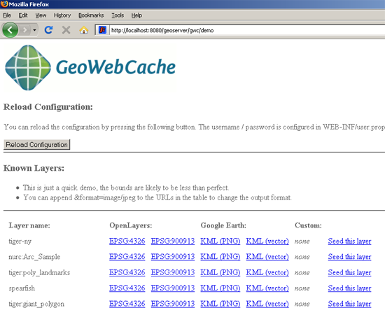
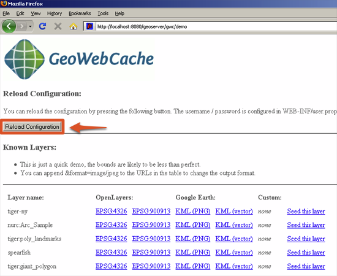

.. _gwc_demo:

Demo page
=========

GeoWebCache comes with a demo page that allows quick access to some of the most basic functionality of the software.  From within the demo page you can view configured layers, reload the configuration to add new layers, and seed/refresh the existing cache on a per-layer basis.

Loading
-------

To view the GeoWebCache demo page, append ``/gwc/demo`` to the address of your GeoServer instance.  For example, if your GeoServer is at the following address::

   http://example.com/geoserver
   
The GeoWebCache demo page is accessible here::

   http://example.com/geoserver/gwc/demo

If there is a problem loading this page, GeoWebCache may be set up incorrectly.  Verify the steps on the :ref:`gwc_using` page have been carried out successfully.

Refreshing layer list
---------------------

The demo page contains a list of every layer that GeoWebCache is aware of.  This is related (but not always identical) to the list of layers as published in GeoServer's WMS GetCapabilities document.  If changes have been made to GeoServer, GeoWebCache will not automatically become aware of them.  If there is a discrepancy, the **Reload Configuration** button will poll GeoServer for the most up-to-date list.  Pressing this button will trigger authentication to GeoServer.  Use the same username and password that you would use to log in to the :ref:`web_admin`.  (See :ref:`webadmin_basics` for more information.)  After a successful login, the number of layers found and loaded will be displayed.

Layers and output formats
-------------------------

For each layer that GeoWebCache serves, links are available for the following functions:

.. list-table::
   :widths: 30 70

   * - **Option**
     - **Description**
   * - ``OpenLayers - EPSG:4326``
     - Creates an OpenLayers application in the projection EPSG:4326 (standard Latitude/Longitude)
   * - ``OpenLayers - EPSG:900913``
     - Creates an OpenLayers application in the projection EPSG:900913 (Spherical Mercator, the projection used in Google Maps)
   * - ``Google Earth - KML (PNG)``
     - Outputs raster KML for viewing in Google Earth 
   * - ``Google Earth - KML (vector)``
     - Outputs vector KML for viewing in Google Earth
   * - ``Custom``
     -

Also on the list is an option to **Seed this layer**.  More on this option can be found on the :ref:`gwc_seeding` page.