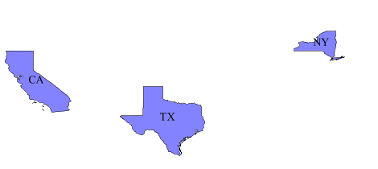
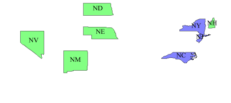
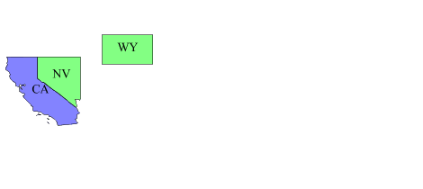
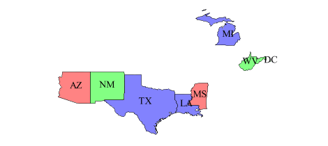
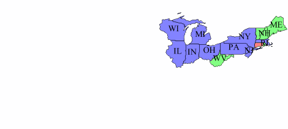

.. _cql_tutorial:

CQL
===

CQL (OGC Common Query Language) is a query language created by OGC for the `Catalogue WebServices specification <http://www.opengeospatial.org/standards/cat>`_. Unlike the OGC Filter specification, CQL is plain text, human readable, and thus well suited for manual construction as opposed to machine generation.

GeoServer supports the use of CQL in WMS and WFS requests, as well as in dynamic symbolizers. This tutorial introduces the language by example.

Getting started
---------------
All the following examples are going to use the ``topp:states`` sample layer shipped with GeoServer, and will use the CQL_FILTER vendor parameter to show how the CQL filters alter the map appearance. The easiest way to follow the tutorial is to open your GeoServer map preview, click on the *options* button at the top of the map preview, in order to open the advanced options toolbar, and enter the filter in the CQL box.

.. figure:: gettingStarted.png
   :align: center
   
   *topp:states preview with advanced toolbar open.*
   
The attributes we'll be using in the filters are those included in the layer itself.
This is an example of attribute names and values for the state of Colorado:

.. list-table::
   
  * - **Attribute**
    - **states.6**
  * - STATE_NAME
    - Colorado
  * - STATE_FIPS
    - 08
  * - SUB_REGION
    - Mtn
  * - STATE_ABBR
    - CO
  * - LAND_KM
    - 268659.501
  * - WATER_KM
    - 960.364
  * - PERSONS
    - 3294394.0
  * - FAMILIES
    - 854214.0
  * - HOUSHOLD
    - 1282489.0
  * - MALE
    - 1631295.0
  * - FEMALE
    - 1663099.0
  * - WORKERS
    - 1233023.0
  * - DRVALONE
    - 1216639.0
  * - CARPOOL
    - 210274.0
  * - PUBTRANS
    - 46983.0
  * - EMPLOYED
    - 1633281.0
  * - UNEMPLOY
    - 99438.0
  * - SERVICE
    - 421079.0
  * - MANUAL
    - 181760.0
  * - P_MALE
    - 0.495
  * - P_FEMALE
    - 0.505
  * - SAMP_POP
    - 512677.0 
    

Non geographic filters
----------------------
   
Let's get started with the simplest example. In CQL basic arithmetic and comparisons 
do look exactly like plain text. The filter ``PERSONS > 15000000`` will extract only states that do
have more than 15 million inhabitants:

   
   *PERSONS > 15000000*
   
Comparing with text is similar. In order to get only the state of California, the filter will be
``STATE_NAME = 'California'``. More complex text comparisons are available using ``LIKE`` comparisons. ``STATE_NAME LIKE 'N%'`` will extract all states starting with an ``N``.

   
   *STATE_NAME LIKE 'N%'*
   
It is also possible to compare two attributes with each other. ``MALE > FEMALE`` selects the
states in which the male population surpasses the female one (a rare occurrence):

   
   *MALE > FEMALE*
   
It is also possible to make simple math expressions using the ``+, -, *, /`` operators.
However, order is important in this case: CQL mandates that expressions other than
attribute names can appear only in the second member of a comparison. So, for example,
the filter ``UNEMPLOY / (EMPLOYED + UNEMPLOY) > 0.07`` will be invalid, whilst ``UNEMPLOY > 0.07 * (EMPLOYED + UNEMPLOY)`` is valid: 

   
   *UNEMPLOY > 0.07 * (EMPLOYED + UNEMPLOY)*
   
Geographic filters
------------------
CQL provides a full set of geographic filter capabilities. Say, for example, you want to display only the states that do cross the (-90,40,-60,45) bounding box.
The filter will be ``BBOX(the_geom, -90, 40, -60, 45)``

   
   *BBOX(the_geom, -90, 40, -60, 45)*
   

