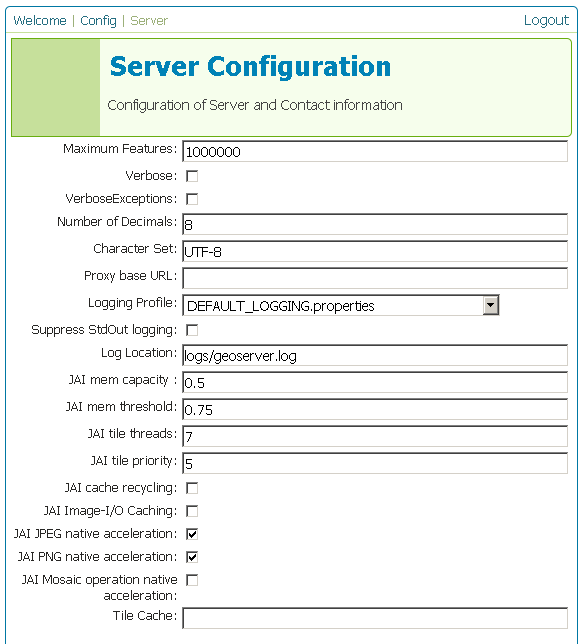

.. _web_admin_config_server:

Server
======

The Server Configuration page, accessed from the **Server** link, is where global server settings are made.

   *Server Configuration page*

.. list-table::
   :widths: 20 80

   * - **Option**
     - **Description**
   * - ``Maximum Features``
     -
   * - ``Verbose``	
     -
   * - ``VerboseExceptions``
     -
   * - ``Number of Decimals``
     -
   * - ``Character Set``
     -
   * - ``Proxy base URL`` 	
     -
   * - ``Logging Profile``
     -
   * - ``Suppress StdOut logging``
     -
   * - ``Log Location`` 
     -
   * - ``JAI mem capacity``
     - 	
   * - ``JAI mem threshold``
     -
   * - ``JAI tile threads``
     -
   * - ``JAI tile priority``
     -
   * - ``JAI cache recycling``
     -  	
   * - ``JAI Image-I/O Caching``
     -
   * - ``JAI JPEG native acceleration``
     -
   * - ``JAI PNG native acceleration``
     -
   * - ``JAI Mosaic operation native acceleration``
     - 
   * - ``Tile Cache``	 
     - 

This page also has space for contact information.  This information is contained in the capabilities documents and will be publicly accessible.

.. figure:: serverconfig2.png
   :align: center

   *Server Configuration page, continued*

.. list-table::
   :widths: 40
   
   * - **Option**
   * - ``Contact Person``
   * - ``Organization``
   * - ``Position``
   * - ``Address Type``
   * - ``Address``
   * - ``City``
   * - ``State/Province``
   * - ``Postal Code``
   * - ``Country``
   * - ``Phone Number``
   * - ``Fax Number``
   * - ``Email Address``
