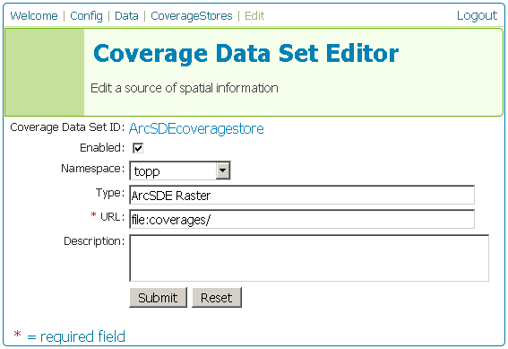

.. _arcsde_data:

ArcSDE
======

.. warning:: ArcSDE support is not enabled by default and requires the ArcSDE extension to be installed prior to use.

ESRI's `ArcSDE <http://www.esri.com/software/arcgis/arcsde/>`_ is a spatial 
engine that runs on top of a relational database such as Oracle or SQL Server.

The ArcSDE extension is based on the GeoTools ArcSDE driver. See the `GeoTools 
ArcSDE page <http://docs.codehaus.org/display/GEOTDOC/ArcSDE+DataStore>`_ for 
more technical details.

Supported versions
------------------

The extension supports ArcSDE versions 9.2 and 9.3.

Adding a vector datastore
-------------------------

In order to serve vector data layers, it is first necessary to register
the ArcSDE instance as a datastore in GeoServer.
Navigate to the **Create New Feature Data Set** page 
(**Config** -> **Data** -> **Datastore** -> **New**) and an option for 
**ArcSDE** will be in the dropdown menu for **Feature Data Set 
Description.** Select this option, enter a name in the box for **Feature 
Data Set ID**, and click **New**. 

.. figure:: arcsdecreate.png
   :align: center

   *Figure 1: Creating a new ArcSDE datastore*

Vector datastore options
------------------------   
   
The next page contains configuration options for the ArcSDE instance.  Fill out the form then click **Submit**.  To apply the changes, click **Apply** then **Save**.   
   
.. figure:: arcsdeconfigure.png
   :align: center

   *Figure 2: Configuring a new ArcSDE datastore*

.. list-table::
   :widths: 20 10 80

   * - **Option**
     - **Required?**
     - **Description**
   * - ``Feature Data Set ID``
     - N/A
     - The name of the datastore as set on the previous page.
   * - ``Enabled``
     - N/A
     - When this box is checked the datastore will be available to GeoServer
   * - ``Namespace``
     - Yes
     - The namespace associated with the datastore.
   * - ``Description``
     - No
     - A description of the datastore.
   * - ``server``
     - Yes
     - The URL of the ArcSDE instance. 	 
   * - ``port``
     - Yes
     - The port that the ArcSDE instance is set to listen to.  Default is 5151.
   * - ``instance``
     - No
     - The name of the specific ArcSDE instance (if more than one).
   * - ``user``
     - Yes
     - The username to authenticate with the ArcSDE instance.	 
   * - ``password``
     - No
     - The password associated with the above username for authentication with the ArcSDE instance.
   * - ``pool.minConnections``
     - No
     - Connection pool configuration parameters. See the :ref:`connection_pooling` section for details.
   * - ``pool.maxConnections``
     - No
     - Connection pool configuration parameters. See the :ref:`connection_pooling` section for details. 
   * - ``pool.timeOut``
     - No
     - Connection pool configuration parameters. See the :ref:`connection_pooling` section for details. 
  
You may now add featuretypes as you would normally do, by navigating to 
the **Create New Feature Type** page (**Config** -> **Data** -> 
**Featuretype** -> **New**).

Adding a raster coveragestore
-----------------------------

In order to serve raster layers (or coverages), it is first necessary to register
the ArcSDE instance as a coveragestore in GeoServer.
Navigate to the **Create New Coverage Data Set** page 
(**Config** -> **Data** -> **Coveragestores** -> **New**) and an option for 
**ArcSDE Raster Format** will be in the dropdown menu for **Coverage Data Set 
Description.** Select this option, enter a name in the box for **Coverage 
Data Set ID**, and click **New**.

.. figure:: arcsdecoveragecreate.png
   :align: center

   *Figure 3: Creating a new ArcSDE coveragestore*

Raster coveragestore options
----------------------------

The next page contains configuration options for the ArcSDE instance.  Fill out the form then click **Submit**.  To apply the changes, click **Apply** then **Save**.
   

   *Figure 4: Configuring a new ArcSDE coveragestore*

.. list-table::
   :widths: 20 10 80

   * - **Option**
     - **Required?**
     - **Description**
   * - ``Coverage Data Set ID``
     - N/A
     - The name of the coveragestore as set on the previous page.
   * - ``Enabled``
     - N/A
     - When this box is checked the coveragestore will be available to GeoServer
   * - ``Namespace``
     - Yes
     - The namespace associated with the coveragestore.
   * - ``Type``
     - No
     - The type of coveragestore.  Leave this to say ``ArcSDE Raster``. 	 
   * - ``URL``
     - Yes
     - The URL of the ArcSDE instance.
   * - ``Description``
     - No
     - A description of the coveragestore.

You may now add coverages as you would normally do, by navigating to 
the **Create New Coverage Type** page (**Config** -> **Data** -> 
**Coverages** -> **New**).

Performance considerations
--------------------------

Common problems
---------------
