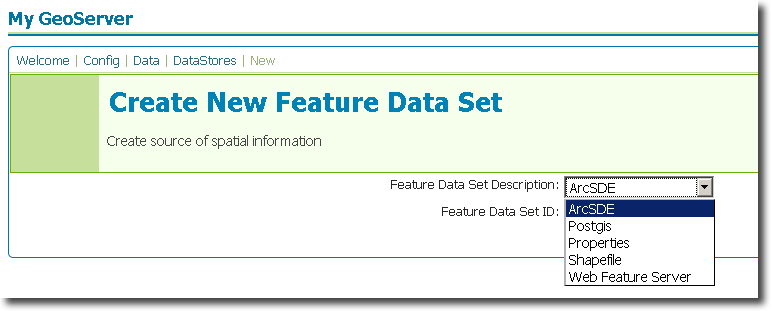

.. _arcsde:

ArcSDE
======

ESRI's `ArcSDE <http://www.esri.com/software/arcgis/arcsde/>`_ is a spatial 
engine that runs on top of a relational database such as Oracle or SQL Server.

.. note::

   GeoServer does not come built in with support for ArcSDE, it must be 
   installed through an extension. Proceed to :ref:`arcsde_installation`
   for installation details.

The ArcSDE extension is based on the GeoTools ArcSDE driver. See the `GeoTools 
ArcSDE page <http://docs.codehaus.org/display/GEOTDOC/ArcSDE+DataStore>`_ for 
more technical details.

Supported versions
------------------

The extension supports ArcSDE versions 9.2 and 9.3.

.. _arcsde_installation:

Installing the ArcSDE extension
-------------------------------

#. Download the ArcSDE extension from the `GeoServer download page <http://geoserver.org/display/GEOS/Download>`_.

   .. warning::

     Ensure the extension matching the version of the GeoServer installation 
     is downloaded.

#. Extract the contents of the archive into the ``WEB-INF/lib`` folder of the 
   GeoServer installation.

ArcSDE client libraries
^^^^^^^^^^^^^^^^^^^^^^^

#. Navigate to http://support.esri.com/index.cfm?fa=downloads.patchesServicePacks.listPatches&PID=66

#. Click the ``ArcSDE Service Pack`` link for the appropriate version of SDE.

#. Navigate to ``Installing this Service Pack -> ArcSDE SDK -> UNIX`` 
   (regardless of the OS)

#. Download the 32 or 64 bit (depending on the target platform) ``Linux`` 
   archive.

#. Unpack the archive and copy the files ``jpe<VERSION>_sdk.jar`` and 
   ``jsde<VERSION>_sdk.jar`` into the ``WEB-INF/lib`` directory of the 
   GeoServer installation.

IBM ICU4J
^^^^^^^^^

#. Navigate to ftp://ftp.software.ibm.com/software/globalization/icu/icu4j/3.2

#. Download the file ``icu4j_3_2.jar`` and copy it into the ``WEB-INF/lib`` 
   directory of the GeoServer installation.

Adding an ArcSDE database
-------------------------

If the extension is properly installed ``ArcSDE`` will show up as a option when
creating a new data store.

.. figure:: sde_configure.png

ArcSDE options
--------------

.. list-table::
   :widths: 20 80

   * - ``host``
     - The sde server host name or ip address.
   * - ``port``
     - The port on which the sde server is accepting connections.
   * - ``instance``
     - The sde instance to connect to.
   * - ``user``
     - The name of the user to connect to the sde server as.
   * - ``password``     
     - The password to use when connecting to the database. Left blank for no       password.
   * - ``max connections``

       ``min connections``

       ``validate connections``

     - Connection pool configuration parameters. See the 
       :ref:`connection_pooling` section for details.

