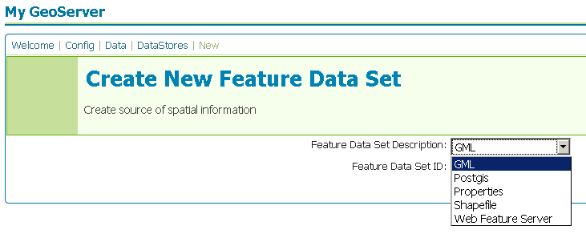

.. _gml:

Geographic Markup Language (GML)
================================

Geographic Markup Language (GML) is a XML based format for representing vector
based spatial data.

.. note::
  
   GeoServer does not come built-in with support for GML, it must be 
   installed through an extension. Proceed to :ref:`gml_installation` for
   installation details.

.. warning::

   Currently the GML extension is unmaintained and carries unsupported status.
   While still usable, do not expect the same reliability as with other
   drivers.

Supported versions
------------------

Currently GML version 2 is supported.

.. _gml_installation:

Installing the GML extension
----------------------------

#. Download the GML extension from the `GeoServer download page 
   <http://geoserver.org/display/GEOS/Download>`_.

   .. warning::

      Ensure the extension matching the version of the GeoServer installation 
      is downloaded.

#. Extract the contents of the archive into the ``WEB-INF/lib`` directory of 
   the GeoServer installation.

Adding a GML file
-----------------

Once the extension is properly installed ``GML`` will show up as an option 
when creating a new data store.

   *Creating a GML datastore*

.. figure:: pix/gml_configure.png
   :align: center

   *Configuring a GML datastore*

GML options
-------------

.. list-table::
   :widths: 20 80

   * - ``url``
     - The location of the GML file.
  