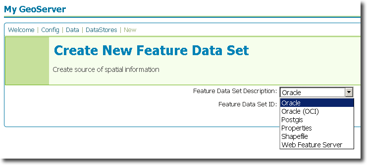
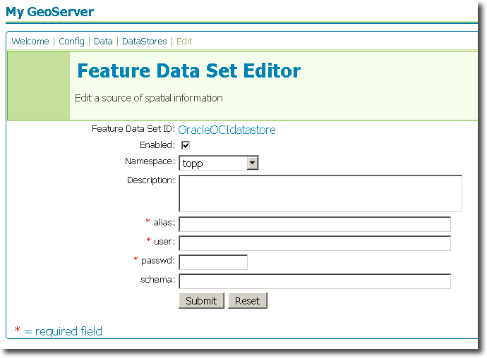

.. _data_oracle:

Oracle
======

`Oracle <http://www.oracle.com/technology/products/spatial/index.html>`_ 
Spatial and Locator are the spatial extensions of Oracle.

  .. note::

     GeoServer does not come built-in with support for Oracle, it must be 
     installed through an extension. Proceed to :ref:`oracle_installation` for
     installation details.

Supported versions
------------------

.. _oracle_installation:

Installing the Oracle extension
-------------------------------

#. Download the Oracle extension from the `GeoServer download page 
   <http://geoserver.org/display/GEOS/Download>`_.

   .. warning::

      Ensure the extension matching the version of the GeoServer installation 
      is downloaded.

#. Extract the contents of the archive into the ``WEB-INF/lib`` directory of 
   the GeoServer installation.

Oracle Call Interface (OCI)
---------------------------

A connection can be established in one of two ways. The **standard** way to 
connect to oracle is with the JDBC driver, a completely portable Java library
that runs as a thin client on any computer. This is the **recommended** way
to establish an oracle connection..

An alternative is to establish an OCI (Oracle Call Interface) connection. 
This requires the OCI drivers to be installed on the same machine as the 
GeoServer instance is running on. Connecting with OCI has the benefit of
increased performance.

Adding an Oracle database
-------------------------

Once the extension is properly installed ``Oracle`` and ``Oracle OCI`` will
show up as a options when creating a new data store.

Oracle options
--------------

.. figure:: oracle_configure.png

.. list-table::
   :widths: 20 80

   * - ``host``
     - The oracle server host name or ip address.
   * - ``port``
     - The port on which the oracle server is accepting connections.
   * - ``user``
     - The name of the user to connect to the oracle database as.
   * - ``password``     
     - The password to use when connecting to the database. Left blank for no
       password.
   * - ``instance``
     - The name of the oracle instance being connected to.
   * - ``schema``
     - The database schema to access tables from.
   * - ``max connections``

       ``min connections``

       ``validate connections``

     - Connection pool configuration parameters. See the 
       :ref:`connection_pooling` section for details.

Oracle OCI options
------------------

.. list-table::
   :widths: 20 80

   * - ``alias``
     - 
   * - ``user``
     - The name of the user to connect to the oracle database as.
   * - ``password``     
     - The password to use when connecting to the database. Left blank for no
       password.
   * - ``schema``
     - The database schema to access tables from.
