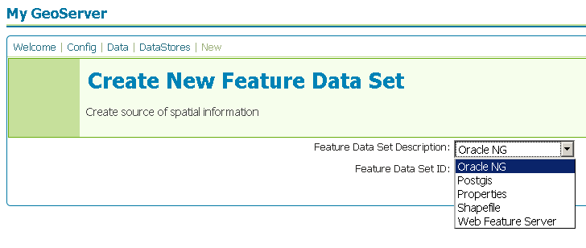

.. _oracleng:

Oracle Next Generation
======================

`Oracle <http://www.oracle.com/technology/products/spatial/index.html>`_ 
Spatial and Locator are the spatial extensions of Oracle.

  .. note::

     GeoServer does not come built-in with support for Oracle, it must be 
     installed through an extension. Proceed to :ref:`oracle_installation` for
     installation details.

Supported versions
------------------

.. _oracle_installation:

Installing the Oracle NG extension
-----------------------------------

#. Download the Oracle NG extension from the `GeoServer download page 
   <http://geoserver.org/display/GEOS/Download>`_.

   .. warning::

      Ensure the extension matching the version of the GeoServer installation 
      is downloaded.

#. Extract the contents of the archive into the ``WEB-INF/lib`` directory of 
   the GeoServer installation.

Adding an Oracle database
-------------------------

Once the extension is properly installed ``OracleNG`` will show up as an
option when creating a new data store.

Oracle options
--------------

.. figure:: oracleng_configure.png

.. list-table::
   :widths: 20 80

   * - ``host``
     - The oracle server host name or ip address.
   * - ``port``
     - The port on which the oracle server is accepting connections.
   * - ``database``
     - The name of the database to connect to.
   * - ``schema``
     - The database schema to access tables from.
   * - ``user``
     - The name of the user to connect to the oracle database as.
   * - ``password``     
     - The password to use when connecting to the database. Left blank for no
       password.
   * - ``Loose bbox``
     - 	Flag which controls how bounding box comparisons are made against
        geometries in the database. See the :ref:`loose_bbox` section
        below for more information.
   * - ``max connections``

       ``min connections``

       ``validate connections``

     - Connection pool configuration parameters. See the 
       :ref:`connection_pooling` section for details.

.. _loose_bbox:

Using loose bounding box
------------------------

When set only the bounding box of a geometry is used which results in a
significant performance gain. The downside is that some geometries may be
considered inside of a bounding box when they are technically not.

If the primary use of the database is through the WMS this flag can be set as
a loss of some accuracy is usually acceptable. However if using with the WFS
and making use of BBOX filtering capabilities, this flag should not be set.
