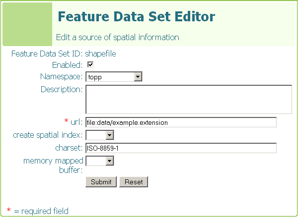

.. _shapefile:

Shapefile
=========

.. note:: 

   While GeoServer has good support for the Shapefile format, it is not the recommended format of choice in a production environment. Databases such as PostGIS are more suitable in production and offer better performance and scalability.

Adding a Shapefile
------------------

As with all vector formats, adding a Shapefile to GeoServer involves adding a new data store through the web administration tool. This process is described step by step in the :ref:`shapefile_quickstart` tutorial.

Shapefile options
-----------------

.. list-table::
   :widths: 20 80

   * - ``url``
     - The location of the Shapefile. See the section below about
       :ref:`abs_vs_rel_file_paths`.
   * - ``create spatial index``
     - A flag which indicates if a spatial index should be created for the
       Shapefile.
   * - ``charset``
     - Specifies the character set to use when reading attribute information 
       from the associated DBF file.
   * - ``memory mapped buffer``
     - A flag which indicates wether memory mapped i/o should be used when 
       reading the shapefile.

.. _abs_vs_rel_file_paths:

Relative vs absolute file paths
-------------------------------

When specifying the location of a Shapefile can be given as an *absolute* path or a *relative* path. An **absolute** file path specifies the location from the root of the file system. For example::

   file:C:\gis_data\shapefiles\my_shapefile.shp

A **relative** file path specifies the location relative to the root of the GeoServer data directory. For example::

   file:data/shapefiles/my_shapefile.shp

Performance considerations
--------------------------

Common problems
---------------

