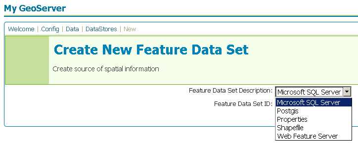

.. _sqlserver:

SQL Server
==========

Microsoft's `SQL Server <http://www.microsoft.com/sqlserver/2008/>` is a 
relational database with spatial functionality.

.. note::

   GeoServer does not come built-in with support for SQL Server, it must be 
   installed through an extension. Proceed to :ref:`sqlserver_installation`
   for installation details.

Supported versions
------------------

The extension supports SQL Server 2008.

.. _sqlserver_installation:

Installing the SQL Server extension
-----------------------------------

#. Download the SQL Server extension from the `GeoServer download page 
   <http://geoserver.org/display/GEOS/Download>`_.

   .. warning::

      Ensure the extension matching the version of the GeoServer installation 
      is downloaded.

#. Extract the contents of the archive into the ``WEB-INF/lib`` directory of 
   the GeoServer installation.

SQL Server JDBC driver
``````````````````````

#. Navigate to `Microsoft's JDBC driver download page 
   <http://msdn.microsoft.com/en-us/data/aa937724.aspx>`_.

#. Click the ``Download SQL Server 2005 JDBC Driver 1.2`` link.

#. Click the ``Download`` button.

# Accept the license and choose the operating system.

# Extract the contents of the archive and copy the file ``sqljdbc.jar`` to the
  ``WEB-INF/lib`` directory of the GeoServer instance.

Adding a SQL Server database
----------------------------

Once the extension is properly installed ``SQL Server`` will
show up as an option when creating a new data store.



   *Creating a SQL Server datastore*

.. figure:: pix/sqlserver_configure.png
   :align: center

   *Configuring a SQL Server datastore*

SQL Server options
------------------

  * - ``host``
    - The sql server instance host name or ip address.
  * - ``port``
    - The port on which the sql server instance is accepting connections.
  * - ``database``
    - The name of the database to connect to.
  * - ``schema``
    - The database schema to access tables from.
  * - ``user``
    - The name of the user to connect to the oracle database as.
  * - ``password``     
    - The password to use when connecting to the database. Left blank for no
      password.
  * - ``max connections``

      ``min connections``

    - Connection pool configuration parameters. See the 
      :ref:`connection_pooling` section for details.
