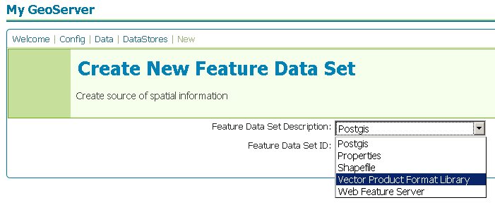

.. _vpf:

Vector Product Format
=====================

Vector Product Format (VPF) is a military standard for vector-based digital
map products produced by the U.S. Department of Defense. For more information
visit `The National Geospatial-Intelligence Agency 
<http://www.nga.mil/portal/site/nga01/index.jsp?epi-content=GENERIC&itemID=a2986591e1b3af00VgnVCMServer23727a95RCRD&beanID=1629630080&viewID=Article>`_.

.. note::

     GeoServer does not come built-in with support for VPF, it must be 
     installed through an extension. Proceed to :ref:`vpf_installation` for
     installation details.

.. _vpf_installation:

Installing the VPF extension
----------------------------

#. Download the VPF extension from the `GeoServer download page 
   <http://geoserver.org/display/GEOS/Download>`_.

   .. warning::

      Ensure the extension matching the version of the GeoServer installation 
      is downloaded.

#. Extract the contents of the archive into the ``WEB-INF/lib`` directory of 
   the GeoServer installation.

Adding a VPF file
-----------------

Once the extension is properly installed ``Vector Product Format Library``
will show up as an option when creating a new data store.

   *Creating a VPF datastore*

.. figure:: pix/vpf_configure.png
   :align: center

   *Configuring a VPF datastore*

VPF options
-----------

.. list-table::
   :widths: 20 80

   * - ``url``
     - The location of the VPF file.

