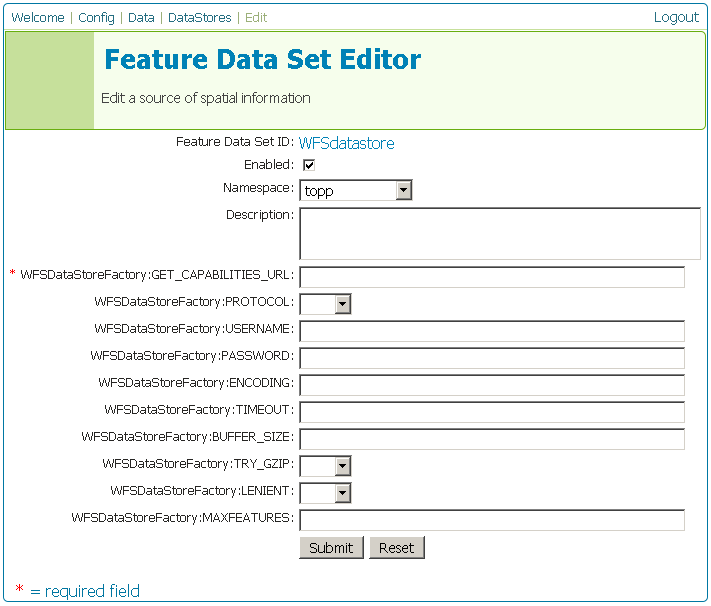

.. _wfs_data:

External Web Feature Server
===========================

Overview
--------

GeoServer has the ability to load data from a remote Web Feature Server (WFS).  This is useful if the WFS lacks certain functionality that GeoServer contains.  For example, if the WFS is not also a Web Map Server (WMS), data from the WFS can be cascaded through GeoServer to utilize GeoServer's WMS.  If the remote WFS has a WMS but that WMS cannot output KML, data can be cascaded through GeoServer's WMS to output KML.

Adding an external WFS
----------------------

To connect to an external WFS, it is necessary to load it as a new datastore.
Navigate to the **Create New Feature Data Set** page 
(**Config** -> **Data** -> **Datastore** -> **New**) and an option for 
**Web Feature Server** will be in the dropdown menu for **Feature Data Set 
Description.** Select this option, enter a name in the box for **Feature 
Data Set ID**, and click **New**.

.. figure:: pix/wfscreate.png
   :align: center

   *Creating a new datastore from an external WFS*
   
Web Feature Server options
--------------------------

The next page contains configuration options for connecting to the remote WFS.  Fill out the form then click **Submit**.  To apply the changes, click **Apply** then **Save**.

   *Configuring a new datastore from an external WFS*

.. list-table::
   :widths: 20 10 80

   * - **Option**
     - **Required?**
     - **Description**
   * - ``Feature Data Set ID``
     - N/A
     - The name of the datastore as set on the previous page.
   * - ``Enabled``
     - N/A
     - When this box is checked the datastore will be available to GeoServer
   * - ``Namespace``
     - Yes
     - The namespace associated with this datastore.
   * - ``Description``
     - No
     - A description of this datastore.
   * - ``WFSDataStoreFactory:GET_CAPABILITIES_URL``
     - Yes
     - The URL of the GetCapabilities document of the remote WFS.
   * - ``WFSDataStoreFactory:PROTOCOL``
     - No
     - (T/F):
   * - ``WFSDataStoreFactory:USERNAME``
     - No
     - The username to use for authentication with the WFS.
   * - ``WFSDataStoreFactory:PASSWORD``
     - No
     - The password associated with the above username for authentication with the WFS.
   * - ``WFSDataStoreFactory:ENCODING``
     - No
     - 
   * - ``WFSDataStoreFactory:TIMEOUT``
     - No
     - 
   * - ``WFSDataStoreFactory:BUFFER_SIZE``
     - No
     - 
   * - ``WFSDataStoreFactory:TRY_GZIP``
     - No
     - (T/F):
   * - ``WFSDataStoreFactory:LENIENT``
     - No
     - (T/F):  
   * - ``WFSDataStoreFactory:MAXFEATURES``
     - No
     - Sets the maximum features for the remote WFS to return.  
	 
You may now add featuretypes as you would normally do, by navigating to 
the **Create New Feature Type** page (**Config** -> **Data** -> 
**Featuretype** -> **New**).

.. note:: Should more info go here, or should this point elsewhere?

	 
	 
Performance considerations
--------------------------

Common problems
---------------