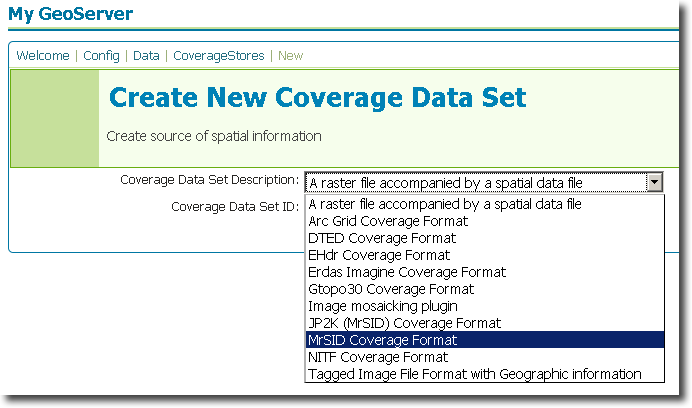
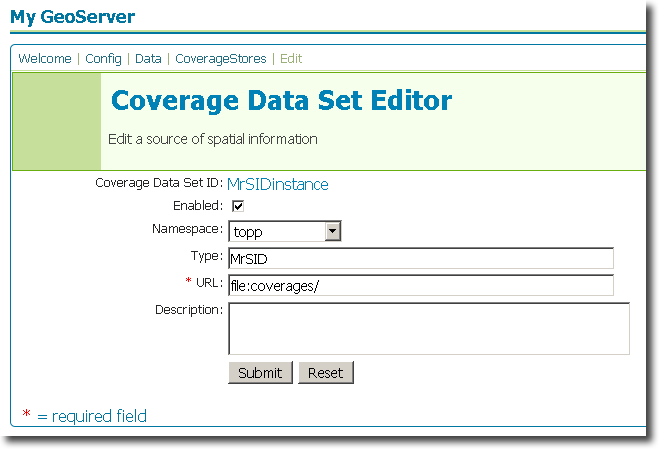

.. _gdal_extension:

GDAL
====

Introduction
------------

The `ImageIO-ext <http://imageio-ext.dev.java.net/>`_ GDAL coveragestore 
extension leverages the `GDAL <http://www.gdal.org/>`_ libraries to read 
selected coverage formats. GDAL supports a wide variety of formats, but 
the extensions that is shipped with GeoServer supports only the most 
commonly used ones (and only those that are freely distributable). 


Supported GDAL Formats
----------------------

* `Digital Terrain Elevation Data (DTED) <http://www.gdal.org/frmt_dted.html>`_
* `ESRI hdr (EHdr) <http://www.gdal.org/frmt_various.html#EHdr>`_ 
* `ERDAS IMAGINE <http://www.gdal.org/frmt_various.html#EIR>`_
* `JPEG2000 (via MrSID) <http://www.gdal.org/frmt_jp2mrsid.html>`_
* `Multi-Resolution Seamless Image Database (MrSID) <http://www.gdal.org/frmt_mrsid.html>`_
* `National Imagery Transmission Format (NITF) <http://www.gdal.org/frmt_nitf.html>`_


Unsupported GDAL Formats
------------------------

* ECW
* JPEG2000 (via Kakadu)


Installation
------------

GeoServer artifacts
```````````````````

#. Download the GDAL extension from the `GeoServer download page <http://geoserver.org/display/GEOS/Download>`_.  Make sure to match the extension version with your GeoServer version.
#. Extract the contents of the archive to the ``WEB-INF/lib`` directory of your GeoServer instance.

Other artifacts
```````````````

In addition to the GeoServer extension, the GDAL native libraries need to be installed on the same system as your GeoServer instance.  The installation instructions vary depending on operating system.

**Windows**

#. Download the `Windows GDAL native library <http://geoserver.org/download/attachments/8978509/windows-gdal-mrsid_1.7.0_onwards.zip?version=1>`_
#. Extract this archive to your ``%JAVA_HOME%\bin`` directory.  (If this environment variable is not set, then extract to the ``bin`` directory of the Java version linked to GeoServer.)

**Linux/UNIX**

#. Download the `Linux GDAL native library <http://geoserver.org/download/attachments/8978509/linux-gdal-mrsid_1.7.0_onwards.zip?version=1>`_
#. Extract the archive 

   * If your ``$JAVA_HOME`` directory points to a JDK, extract to ``$JAVA_HOME/jre/lib/i386``
   * If your ``$JAVA_HOME`` directory points to a JRE, extract to ``$JAVA_HOME/lib/i386``

**All systems**

GDAL also requires a GDAL data directory, which allows support for extra EPSG codes.

#. Download the `GDAL data directory <http://geoserver.org/download/attachments/8978509/gdal_data_1.7.0_onwards.zip?version=1>`_
#. Extract the archive to any directory
#. Create a GDAL_DATA environment variable and point it to the directory where the GDAL data was extracted

   * Windows: ``set GDAL_DATA=<directory>``
   * Linux/UNIX: ``export GDAL_DATA=<directory>``

The extension will become active when GeoServer is restarted. 
   
Configuration
-------------

When properly installed, many new types of coveragestores will be 
available. Navigate to the **Create New Coverage Data Set** page 
(**Config** -> **Data** -> **Coveragestore** -> **New**) and the following 
options will appear in the dropdown menu for **Coverage Data Set 
Description.**

* DTED Coverage Format
* EHdr Coverage Format
* Erdas Imagine Coverage Format
* JP2K (MrSID) Coverage Format
* MrSID Coverage Format
* NITF Coverage Format

Select the option that matches with the coveragestore, enter a name in the box for **Coverage 
Data Set ID**, and click **Next**. 



   *Figure 1: Creating a new GDAL coveragestore (MrSID)*

The next page is the **Coverage Data Set Editor** page. Fill out 
the form with information on the GDAL coveragestore to connect to.
Make sure that all files have been copied to the ``coverages``
directory in your GeoServer data directory. When 
finished, click **Submit**, then **Apply** and **Save**. 



   *Figure 2: Configuring a new GDAL datastore (MrSID)*

You may now add coverages as you would normally do, by navigating to 
the **Create New Coverage** page (**Config** -> **Data** -> 
**Coverages** -> **New**). 