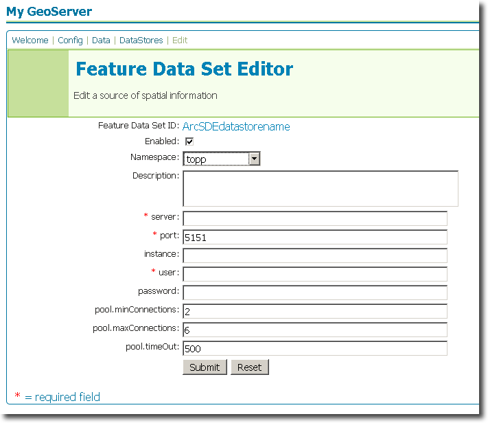

.. _arcsde_extension:

ArcSDE
======

Introduction
------------

The ArcSDE datastore extension adds functionality to GeoServer to allow connection to ArcSDE
instances.

For more information on ArcSDE, please see `ESRI's page on ArcSDE <http://www.esri.com/software/arcgis/arcsde/>`_

This extension is based on work from the GeoTools software project.  Please see the `GeoTools ArcSDE page <http://docs.codehaus.org/display/GEOTDOC/ArcSDE+DataStore>`_ for more technical details.


Installation 
------------

GeoServer artifacts
```````````````````

#. Download the DB2 extension from the `GeoServer download page <http://geoserver.org/display/GEOS/Download>`_.  Make sure to match the extension version with your GeoServer version.
#. Extract the contents of the archive to the ``WEB-INF/lib`` directory of your GeoServer instance.

External artifacts
``````````````````

.. warning:: Due to licensing issues, there are additional files that are 
   not distributed with the above archive that are *required* for it to work.

The additional files required are:

#. ``jsde_sdk.jar`` (also known as ``jsde##_sdk.jar`` where ``##`` is the version number,
   such as ``92`` for **ArcSDE 9.2**)
#. ``jpe_sdk.jar`` (also known as ``jpe##_sdk.jar`` where ``##`` is the version number,
   such as ``92`` for **ArcSDE 9.2**)
#. ``icu4j_3_2.jar`` (only needed for **ArcSDE 9.2** and later)

These files can be downloaded from ESRI's website or copied from the ArcSDE
installation media.

*To download the JSDE/JPE JAR files from ESRI's website:*

#. Navigate to the ESRI support page on `Patches and Service Packs for ArcGIS Server <http://support.esri.com/index.cfm?fa=downloads.patchesServicePacks.listPatches&PID=66>`_
#. Find the link to the latest service pack for your version of ArcSDE
#. Scroll down to **Installing this Service Pack** -> **ArcSDE SDK** -> **UNIX**
   (regardless of your target OS)
#. Download any of the target files (but be sure to match 32/64 bit to your OS)
#. Open the archive, and extract the JARs.

*To download the icu4j JAR file:*

#. Navigate to `IBM's icu4j download site <ftp://ftp.software.ibm.com/software/globalization/icu/icu4j/3.2>`_
#. Download the file ``icu4j_3_2.jar``.

After all files have been downloaded and extracted, copy them to the 
``WEB-INF/lib`` directory of your GeoServer instance. 

The extension will become active when GeoServer is restarted.


Configuration
-------------

When properly installed, a new type of datastore (**ArcSDE**) will be 
available. Navigate to the **Create New Feature Data Set** page 
(**Config** -> **Data** -> **Datastore** -> **New**) and an option for 
**ArcSDE** will be in the dropdown menu for **Feature Data Set 
Description.** Select this option, enter a name in the box for **Feature 
Data Set ID**, and click **Next**. 

.. figure:: arcsdecreate.png
   :align: center

   *Figure 1: Creating a new ArcSDE datastore*

The next page is the **Feature Data Set Editor** page. Fill out 
the form with information on the ArcSDE instance to connect to. When 
finished, click **Submit**, then **Apply** and **Save**. 



   *Figure 2: Configuring a new ArcSDE datastore*

You may now add featuretypes as you would normally do, by navigating to 
the **Create New Feature Type** page (**Config** -> **Data** -> 
**Featuretype** -> **New**). 


