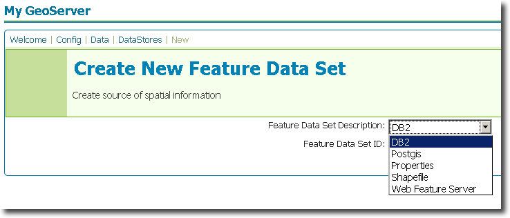
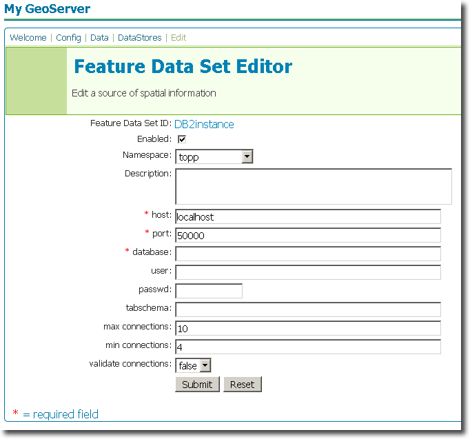

.. _db2_extension:

DB2
===

Introduction
------------

The DB2 datastore extension adds functionality to GeoServer to allow connection to IBM DB2 UDB
instances.

The `IBM DB2 database <http://www.ibm.com/db2/>`_ is a commercial 
relational database implementing ISO SQL standards. It is similar in 
functionality to Oracle, SQL Server, MySQL, PostgreSQL and other 
relational databases. The `DB2 Spatial Extender 
<http://www.ibm.com/software/data/spatial/db2spatial/>`_ is a 
free-of-charge feature of DB2 which implements the OGC specification 
`Simple Features for SQL <http://www.opengeospatial.org/standards/sfs>`_ 
and the ISO standard "SQL/MM Part 3 Spatial" standard. The DB2 Spatial 
Extender is similar in functionality to Oracle Spatial and PostGIS. 


Installation
------------

GeoServer artifacts
```````````````````

#. Download the DB2 extension from the `GeoServer download page <http://geoserver.org/display/GEOS/Download>`_.  Make sure to match the extension version with your GeoServer version.
#. Extract the contents of the archive to the ``WEB-INF/lib`` directory of your GeoServer instance.


External artifacts
``````````````````

.. warning:: Due to licensing issues, there are additional files that are 
   not distributed with the above archive that are *required* for it to work.
   
The additional files required are:

#. ``db2jcc.jar``
#. ``db2jcc_license_cu.jar``

Both can be found in the the DB2 instance installation directory 
(normally ``$DB2PATH/java``) or by downloading the files from IBM's 
website. Copy these two files to the ``WEB-INF/lib`` directory of your 
GeoServer instance. 


*To download the JAR files from* `IBM's website <http://www.ibm.com>`_ 

#. Navigate to **Support & downloads** -> **Download** -> **Fixes, updates & drivers**.
#. In the **Category**, select **Information Management**.  For **Sub-category**, select **DB2 for Linux, UNIX and Windows**.  Click the arrow to proceed.
#. Select the download with appropriate OS, version, and fixpack for your system.
#. Scroll down to the link entitled **IBM DB2 Driver for JDBC and SQLJ** and download the file.
#. Extract the archive, and copy the JAR files to the ``WEB-INF/lib`` directory of your GeoServer instance.

The extension will become active when GeoServer is restarted.


Configuration
-------------

When properly installed, a new type of datastore (**DB2**) will be 
available. Navigate to the **Create New Feature Data Set** page 
(**Config** -> **Data** -> **Datastore** -> **New**) and an option for 
**DB2** will be in the dropdown menu for **Feature Data Set 
Description.** Select this option, enter a name in the box for **Feature 
Data Set ID**, and click **Next**.

.. note:: Table and column names are all case-sensitive when working 
   with GeoServer. When working with DB2 scripts and the DB2 command 
   window, however, the default is to treat these names as upper-case 
   unless enclosed in double-quote characters.



   *Figure 1: Creating a new DB2 datastore*


The next page is the **Feature Data Set Editor** page. Fill out 
the form with information on the DB2 instance to connect to. When 
finished, click **Submit**, then **Apply** and **Save**. 



   *Figure 2: Configuring a new DB2 datastore*
   
You may now add featuretypes as you would normally do, by navigating to 
the **Create New Feature Type** page (**Config** -> **Data** -> 
**Featuretype** -> **New**). 
