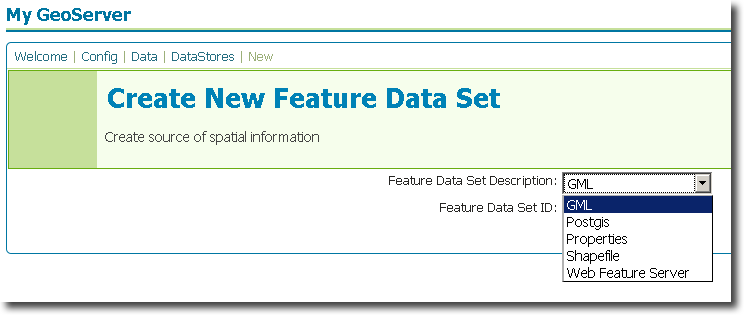

.. _gml_extension:

GML
===

Introduction
------------

The GML datastore extension adds functionality to GeoServer to allow connection to GML datastores.  These are flat files that contain `Geography Markup Language <http://en.wikipedia.org/wiki/Geography_Markup_Language>`_.

Installation
------------

#. Download the GML extension from the `GeoServer download page <http://geoserver.org/display/GEOS/Download>`_.  Make sure to match the extension version with your GeoServer version.
#. Extract the contents of the archive to the ``WEB-INF/lib`` directory of your GeoServer instance.

The extension will become active when GeoServer is restarted.

Configuration
-------------

When properly installed, a new type of datastore (**GML**) will be 
available. Navigate to the **Create New Feature Data Set** page 
(**Config** -> **Data** -> **Datastore** -> **New**) and an option for 
**GML** will be in the dropdown menu for **Feature Data Set 
Description.** Select this option, enter a name in the box for **Feature 
Data Set ID**, and click **Next**.

   *Figure 1: Creating a new GML datastore*

The next page is the **Feature Data Set Editor** page. Fill out the form 
with information on the location and description of the GML file, making 
sure the GML file has been copied to the GeoServer ``data`` directory. 
When finished, click **Submit**, then **Apply** and **Save**. 

.. figure:: gmlconfigure.png
   :align: center

   *Figure 2: Configuring a new GML datastore*

You may now add featuretypes as you would normally do, by navigating to 
the **Create New Feature Type** page (**Config** -> **Data** -> 
**Featuretype** -> **New**). 