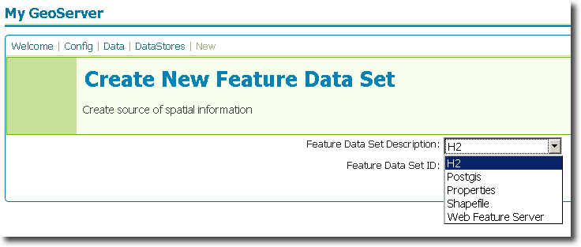
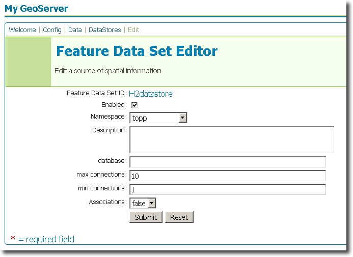

.. _h2_extension:

H2
==

Introduction
------------

The H2 datastore extension adds functionality to GeoServer to allow connection to H2 databases.  The `H2 database <http://www.h2database.com>`_ is a small, free and open source Java SQL database format.

Installation
------------

#. Download the H2 extension from the `GeoServer download page <http://geoserver.org/display/GEOS/Download>`_.  Make sure to match the extension version with your GeoServer version.
#. Extract the contents of the archive to the ``WEB-INF/lib`` directory of your GeoServer instance.

The extension will become active when GeoServer is restarted.

Configuration
-------------

When properly installed, a new type of datastore (**H2**) will be 
available. Navigate to the **Create New Feature Data Set** page 
(**Config** -> **Data** -> **Datastore** -> **New**) and an option for 
**H2** will be in the dropdown menu for **Feature Data Set 
Description.** Select this option, enter a name in the box for **Feature 
Data Set ID**, and click **Next**.

   *Figure 1: Creating a new H2 datastore*

   
The next page is the **Feature Data Set Editor** page. Fill out 
the form with information on the H2 database to connect to. When 
finished, click **Submit**, then **Apply** and **Save**. 

   *Figure 2: Configuring a new H2 datastore*

You may now add featuretypes as you would normally do, by navigating to 
the **Create New Feature Type** page (**Config** -> **Data** -> 
**Featuretype** -> **New**). 