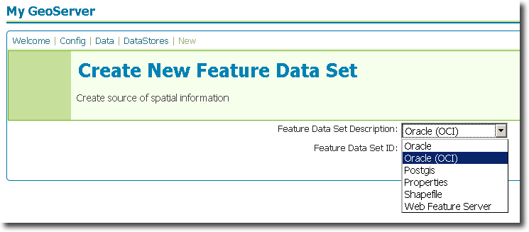
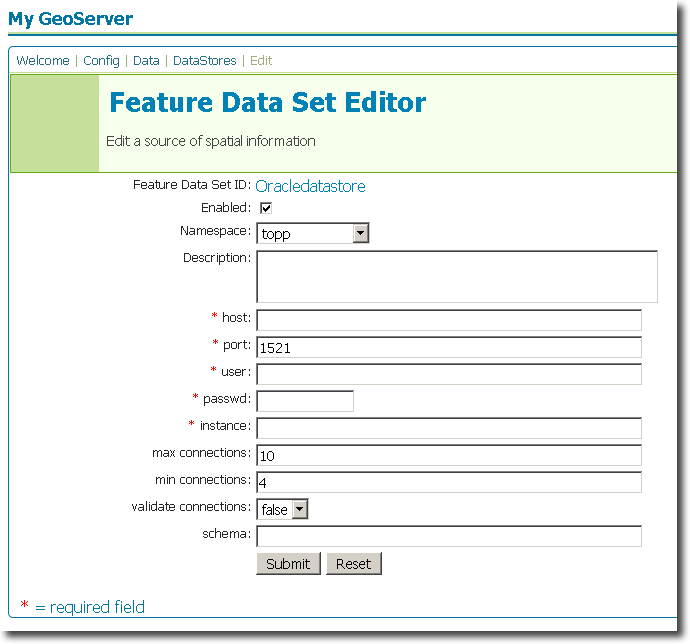

.. _oracle_extension:

Oracle
======

Introduction
------------

The Oracle datastore extension adds functionality to GeoServer to allow connection to `Oracle databases <www.oracle.com/database>`_ that utilize `Oracle Spatial <http://www.oracle.com/technology/products/spatial/index.html>`_.  

There is a choice in the type of connection between Oracle and 
GeoServer. The standard **Oracle** connection uses a completely portable 
JDBC library that runs as a thin client on any computer. If you don't 
have Oracle installed on your computer, and/or are not an Oracle expert, 
then this is the recommnded we recommend this connection. However, 
sometimes GeoServer will be installed on a computer that has all the OCI 
(Oracle Call Interface) drivers needed for a thick connection. In this 
case the thick driver (known as **Oracle OCI** below) is preferable, as 
it leads to a performance increase. 

Installation
------------

#. Download the Oracle extension from the `GeoServer download page <http://geoserver.org/display/GEOS/Download>`_.  Make sure to match the extension version with your GeoServer version.
#. Extract the contents of the archive to the ``WEB-INF/lib`` directory of your GeoServer instance.

The extension will become active when GeoServer is restarted.

Configuration
-------------

When properly installed, two new types of datastore will be 
available, one for **Oracle** and one for **Oracle OCI**.
Navigate to the **Create New Feature Data Set** page 
(**Config** -> **Data** -> **Datastore** -> **New**) and options for 
**Oracle** and **Oracle (OCI)** will be in the dropdown menu for **Feature Data Set 
Description.** Select this option, enter a name in the box for **Feature 
Data Set ID**, and click **Next**.

.. figure:: oraclecreate.png
   :align: center

   *Figure 1: Creating a new Oracle datastore*
   

   *Figure 2: Creating a new Oracle OCI datastore*   

The next page is the **Feature Data Set Editor** page. Fill out the form 
with information about the Oracle database.  The form is slightly different depending on
if the type of connection to the database.  When finished, click **Submit**, then **Apply** and **Save**. 

   *Figure 3: Configuring a new Oracle datastore*

.. figure:: oracleociconfigure.png
   :align: center

   *Figure 4: Configuring a new Oracle OCI datastore*
   
  
You may now add featuretypes as you would normally do, by navigating to 
the **Create New Feature Type** page (**Config** -> **Data** -> 
**Featuretype** -> **New**). 