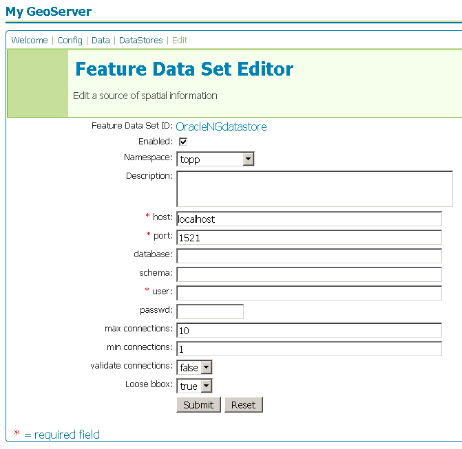

.. _oracleng_extension:

OracleNG
========

Introduction
------------

The Oracle NG ("next generation") datastore extension adds functionality to GeoServer to allow connection to `Oracle databases <www.oracle.com/database>`_ that utilize `Oracle Spatial <http://www.oracle.com/technology/products/spatial/index.html>`_.  The Oracle NG datastore extensions will eventually replace the standard Oracle datastore extension.

Installation
------------

#. Download the Oracle NG extension from the `GeoServer download page <http://geoserver.org/display/GEOS/Download>`_.  Make sure to match the extension version with your GeoServer version.
#. Extract the contents of the archive to the ``WEB-INF/lib`` directory of your GeoServer instance.

The extension will become active when GeoServer is restarted.

Configuration
-------------

When properly installed, a new type of datastore (**Oracle NG**) will be 
available. Navigate to the **Create New Feature Data Set** page 
(**Config** -> **Data** -> **Datastore** -> **New**) and an option for 
**Oracle NG** will be in the dropdown menu for **Feature Data Set 
Description.** Select this option, enter a name in the box for **Feature 
Data Set ID**, and click **Next**.

.. figure:: oraclengcreate.png
   :align: center

   *Figure 1: Creating a new Oracle NG datastore*

The next page is the **Feature Data Set Editor** page. Fill out the form 
with information about the Oracle database.
When finished, click **Submit**, then **Apply** and **Save**. 

   *Figure 2: Configuring a new Oracle datastore*

You may now add featuretypes as you would normally do, by navigating to 
the **Create New Feature Type** page (**Config** -> **Data** -> 
**Featuretype** -> **New**). 