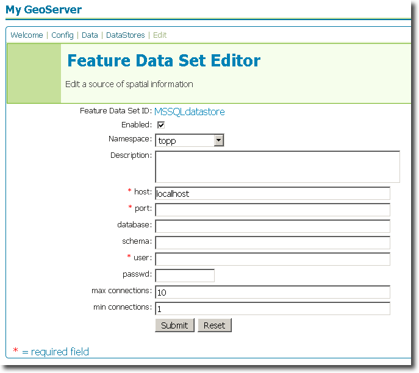

.. _sqlserver_extension:

SQL Server
==========

Introduction
------------

The SQL Server datastore extension adds functionality to GeoServer to allow connection to `Microsoft SQL Server 2008 <http://www.microsoft.com/sqlserver/2008/>`_ databases that include `spatial data <http://www.microsoft.com/sqlserver/2008/en/us/spatial-data.aspx>`_.  

Installation
------------

GeoServer artifacts
```````````````````

#. Download the SQL Server extension from the `GeoServer download page <http://geoserver.org/display/GEOS/Download>`_.  Make sure to match the extension version with your GeoServer version.
#. Extract the contents of the archive to the ``WEB-INF/lib`` directory of your GeoServer instance.


External artifacts
``````````````````

.. warning:: Due to licensing issues, there are additional files that are 
   not distributed with the above archive that are *required* for it to work.
   
The additional file required is the JDBC driver for SQL Server ``sqljdbc.jar``, which can be downloaded from Microsoft's website.

To obtain the JDBC driver:

   #. Navigate to Microsoft's `JDBC Driver website <http://msdn.microsoft.com/en-us/data/aa937724.aspx>`_
   #. Select the link to **Download SQL Server 2005 JDBC Driver 1.2**.
   #. Accept the license
   #. Select the operating system of the download (although any option will suffice in this case)
   #. Extract the archive, and copy ``sqljdbc.jar`` to the ``WEB-INF/lib`` directory of your GeoServer instance.
   
The extension will become active when GeoServer is restarted.


Configuration
-------------

When properly installed, a new type of datastore (**Microsoft SQL Server**) will be 
available. Navigate to the **Create New Feature Data Set** page 
(**Config** -> **Data** -> **Datastore** -> **New**) and an option for 
**Microsoft SQL Server** will be in the dropdown menu for **Feature Data Set 
Description.** Select this option, enter a name in the box for **Feature 
Data Set ID**, and click **Next**.

.. figure:: sqlservercreate.png
   :align: center

   *Figure 1: Creating a new SQL Server datastore*


The next page is the **Feature Data Set Editor** page. Fill out 
the form with information on the SQL Server instance to connect to. When 
finished, click **Submit**, then **Apply** and **Save**. 



   *Figure 2: Configuring a new SQL Server datastore*
   
You may now add featuretypes as you would normally do, by navigating to 
the **Create New Feature Type** page (**Config** -> **Data** -> 
**Featuretype** -> **New**). 
