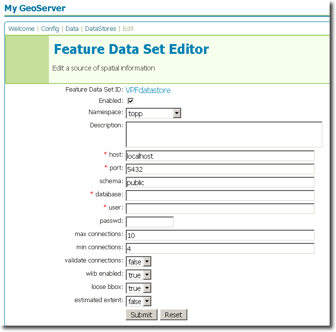

.. _vpf_extension:

VPF
===

Introduction
------------

The VPF datastore extension adds functionality to GeoServer to allow connection to VPF databases.  The Vector Product Format (VPF) is a military standard for vector-based digital map products produced by the U.S. Department of Defense.  The `National Geospatial-Intelligence Agency <http://www.nga.mil/portal/site/nga01/index.jsp?epi-content=GENERIC&itemID=a2986591e1b3af00VgnVCMServer23727a95RCRD&beanID=1629630080&viewID=Article>`_ has more information about VPF.

Installation
------------

#. Download the VPF extension from the `GeoServer download page <http://geoserver.org/display/GEOS/Download>`_.  Make sure to match the extension version with your GeoServer version.
#. Extract the contents of the archive to the ``WEB-INF/lib`` directory of your GeoServer instance.

The extension will become active when GeoServer is restarted.

Configuration
-------------

When properly installed, a new type of datastore (**Vector Product Format Library**) will be 
available. Navigate to the **Create New Feature Data Set** page 
(**Config** -> **Data** -> **Datastore** -> **New**) and an option for 
**Vector Product Format Library** will be in the dropdown menu for **Feature Data Set 
Description.** Select this option, enter a name in the box for **Feature 
Data Set ID**, and click **Next**.

.. figure:: vpfcreate.png
   :align: center

   *Figure 1: Creating a new VPF datastore*

   
The next page is the **Feature Data Set Editor** page. Fill out 
the form with information on the VPF database. When 
finished, click **Submit**, then **Apply** and **Save**. 

   *Figure 2: Configuring a new VPF datastore*

You may now add featuretypes as you would normally do, by navigating to 
the **Create New Feature Type** page (**Config** -> **Data** -> 
**Featuretype** -> **New**).