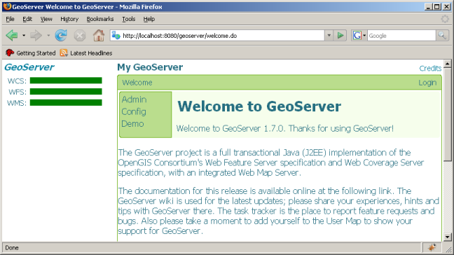

.. _web_admin_quickstart:

Web Administration Interface Quickstart
=======================================

The *Web Administration Tool* is a web based used to configure all aspects of GeoServer, from adding data to tweaking service settings. The web admin tool is accessed via web browser at ``http://<host>:<port>/geoserver``. http://localhost:8080/geoserver in a default installation running on the local host. 

Logging in
----------

In order to change any server settings a user must first be authenticated. Any time the user navigates to ``Config`` from the main page authentication will take place.

.. image:: login-page.png
   :align: center

.. note::

   The default adminstrator **username** is "admin", and the default **password** is "geoserver". To change these defaults see the :ref: section.

The submit-apply-save workflow
------------------------------

Making a change to server configuration with the web admin tool follows a three phase process:

#. *Submit* the page.

   .. image:: submit.png

   At this point the change has been sent to the server, but not applied to the GeoServer instance.

#. *Apply* the change.

   .. image:: apply.png

   Once the change has been applied it is live. However if GeoServer is shutdown the change will not persist.

#. *Save* the change.

   .. image:: save.png

   Saving persists all applied changes to disk so that the change is realized on subsequent GeoServer startups.

.. _map_preview:

map preview
-----------

The *map preview* tool provides a built-in `OpenLayers <http://openlayers.org>`_ map for each layer being published by a GeoServer instance. It can be a useful tool for verifying the configuration of a particular layer, or as a means to explore a layer visually.

The map preview  tool is found by navigating to the ``Demo`` section from the main Welcome page and selecting ``Map Preview``.

    .. image:: map-preview.png
       :align: center

.. _sample_request_tool:

Sample request tool
-------------------

The *sample request* tool provides a form based interface for executing requests against GeoServer. It can be a useful tool for experimenting with various GET and POST requests.

The sample request tool is found by navigating to the ``Demo`` section from the main Welcome page and selecting ``Sample Requests``.

   .. image:: sample-request.png
      :align: center

As well as allowing the user to specify request, the sample request tool also provides a set of "pre-canned" requests. These requests originate from the ``demo`` directory inside of the GeoServer data directory. 
