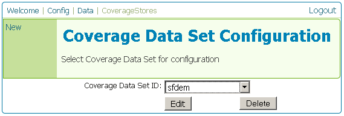
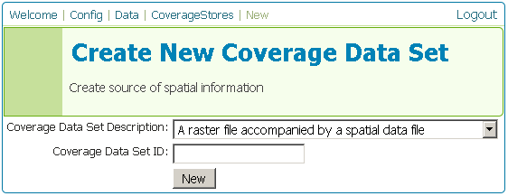
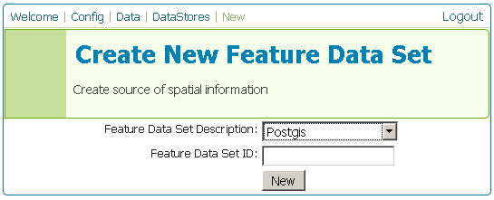
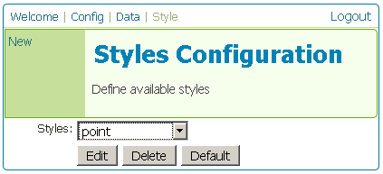
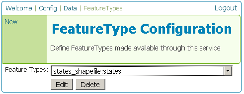
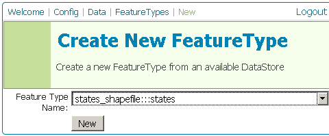
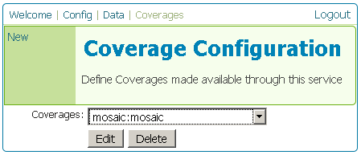

.. _web_admin_config_data:

Data
====

This section is for configuring your data.  The majority of configuration of GeoServer is done in this section.

.. _web_admin_config_namespace:

Namespace
---------

A **namespace** is a container which is used to organize other items such as datastores and featuretypes.  In GeoServer, a namespace is often used to group similar layers together.  Layers are often referred to by their namespace, a colon, and the featuretype.  (Ex:  topp:states)  Two different featuretypes having the same name can exist as long as they are in different namespaces.  (Ex: ns1:mylayer, ns2:mylayer)

On this page, you can register a new namespace, edit (configure) an existing namespace, or delete (unregister) a namespace.  You can also set the default namespace.

.. figure:: namespace.png
   :align: center
   
   *Namespace Configuration page*


.. _web_admin_config_namespace_new:   
   
New
```

The New page allows new namespaces to be created.  Enter a name, and click **Submit** to edit the new namespace.

.. figure:: namespacenew.png
   :align: center
   
   *New Namespace page*


.. _web_admin_config_namespace_edit:  

Edit
````

The Edit page allows new or existing namespaces to be configured.  Enter a **URI** (Uniform Resource Indicator).  This is a unique identifier, often just a URL.  Each namespace must have a unique URI.  You can can this value for **Prefix**, but it is usually left to be the same as the name of the namespace.

.. figure:: namespaceedit.png
   :align: center
   
   *Edit Namespace page*


.. _web_admin_config_coveragestores:
   
Coveragestores
--------------

A **coveragestore** is a file or group of files that contain one or more coverages (raster data).  It is necessary to register a coveragestore in GeoServer before any coverages from that coveragestore can be loaded.


   
   *Coveragestore Configuration page*

On this page, you can register a new coveragestore, edit (configure) an existing coveragestore, or delete (unregister) a coveragestore.

.. _web_admin_config_coveragestores_new:

New
```

The New page is where new coveragestores are loaded.  Select an option under **Coverage Data Set Description** and name the coveragestore in the box entitled **Coverage Data Set ID**.  Click **Submit** to continue.  The next page will configure the coveragestore.  The exact contents of this page will depend on the specific format chosen, so please see the section on :ref:`data` for information on specific data formats.

.. note:: GeoServer supports many formats natively, but many more can be added through extensions.  Please see the section on :ref:`data` for information on specific data formats.


   
   *New Coveragestore page*

.. _web_admin_config_coveragestores_edit:

Edit
````

The Edit page is where existing coveragestores can be configured.  The exact contents of this page will depend on the specific format chosen, so please see the section on :ref:`data` for information on specific data formats.

.. figure:: coveragestoreedit.png
   :align: center
   
   *Edit Coveragestore page*

.. _web_admin_config_datastores:   
   
Datastores
----------

A **datastore** is a file, group of files, or database that contains featuretypes (vector data). It is necessary to register a datastore in GeoServer before any featuretypes can be loaded.

.. figure:: datastore.png
   :align: center
   
   *Datastore Configuration page*

On this page, you can register a new datastore, edit (configure) an existing datastore, or delete (unregister) a datastore.

.. _web_admin_config_datastores_new: 

New
```

The New page is where new datastores are loaded.  Select an option under **Feature Data Set Description** and name the datastore in the box entitled **Feature Data Set ID**.  Click **Submit** to continue.  The next page will configure the datastore.  The exact contents of this page will depend on the specific format chosen, so please see the section on :ref:`data` for information on specific data formats.

.. note:: GeoServer supports many formats natively, but many more can be added through extensions.  Please see the section on :ref:`data` for information on specific data formats.


   
   *New Datastore page*

.. _web_admin_config_datastores_edit: 

Edit
````

The Edit page is where existing datastores can be configured.  The exact contents of this page will depend on the specific format chosen, so please see the section on :ref:`data` for information on specific data formats.

.. figure:: datastoreedit.png
   :align: center
   
   *Edit Datastore page*

.. _web_admin_config_style:
   
Style
-----

Styles are methods of rendering geospatial data.  Styles for GeoServer are written in Styled Layer Descriptor (SLD), a subset of XML.  Please see the section on :ref:`styling` for more information on working with styles.


   
   *Style Configuration page*

On this page, you can register or create a new style, edit (configure) an existing style, or delete (unregister) a style.

.. _web_admin_config_style_new:

New
```

Create a new style here.  Enter the name of the style and click **New** to go to the **Edit** page.  

.. figure:: stylenew.png
   :align: center
   
   *New Style page*

.. _web_admin_config_style_edit:

Edit
````

The Edit page presents two options for entering an SLD.  There is the option of typing/pasting in SLD code, or selecting and uploading a local file that contains the SLD.  There are two checkboxes, one to **Fully Validate against the SLD schema** and to **Toggle Editor**.  The first box, when checked, ensures that the code is fully compliant with the SLD schema.  The second box toggles between two different text editors in the window.

.. figure:: styleedit.png
   :align: center
   
   *Edit Style page*

.. _web_admin_config_featuretypes:
   
FeatureTypes
------------

A **featuretype** is a data layer that contains geographic features in a vector format.  Featuretypes are contained inside datastores, which need to be loaded prior to registering the featuretype.


   
   *Featuretype Configuration page*

On this page, you can register a new featuretype, edit (configure) an existing featuretype, or delete (unregister) a featuretype.

.. _web_admin_config_featuretypes_new:

New
```

Register a new featuretype on this page.  Select an available featuretype from the list, click **New** and you will be taken to the featuretype **Edit** page.  (If the featuretype in question is not listed, make sure the datastore that contains the featuretype is properly registered.)  


   
   *New Featuretype page*

.. _web_admin_config_featuretypes_edit:

Edit
````

.. note:: Add description of FT edit here!

.. figure:: featuretypeedit.png
   :align: center
   
   *Edit Featuretype page*
 
.. _web_admin_config_coverages:
 
Coverages
---------

A **coverage** is a data layer that contains geographic data in a raster format.  Coverages are within coveragestores, which need to be registered prior to registering the coverage.


   
   *Coverage Configuration page*

On this page, you can register a new coverage, edit (configure) an existing coverage, or delete (unregister) a coverage.

.. _web_admin_config_coverages_new:

New
```

Register a new coverage on this page.  Select an available coverage from the list, click **New** and you will be taken to the coverage **Edit** page.  (If the coverage in question is not listed, make sure the coveragestore that contains the coverage is properly registered.)  

.. figure:: coveragenew.png
   :align: center
   
   *New Coverage page*

.. _web_admin_config_coverages_edit:

Edit
````

.. note:: Add description of Coverage edit here!

.. figure:: coverageedit.png
   :align: center
   
   *Edit Coverage page*