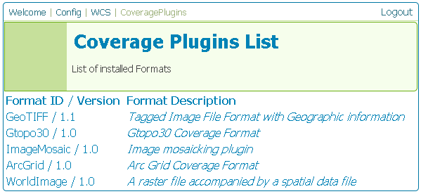

.. _web_admin_config_wcs:

WCS
===

This section is for configuring the Web Coverage Service in GeoServer.

.. figure:: wcs.png
   :align: center
   
   *WCS Configuration page*

Contents
--------

The WCS Contents page allows the WCS to be enabled or disabled.  When disabled, WCS requests will not be processed.  The **Online Resource** box is a URL which contains information relevant to the WCS.

.. figure:: wcscontents.png
   :align: center
   
   *WCS Contents page*

Description
-----------

The WCS Description page is where information about the WCS is populated.  This information is publicly available via the WCS capabilities document.

.. figure:: wcsdescription.png
   :align: center
   
   *WCS Description page*

.. list-table::
   :widths: 20 80

   * - **Option**
     - **Description**
   * - ``Name``
     -
   * - ``Title``
     -
   * - ``Access Constraints``
     -
   * - ``Fees``
     -
   * - ``Maintainer``
     -
   * - ``Keywords``
     -
   * - ``Abstract``
     -

CoveragePlugins
---------------

The WCS CoveragePlugins page displays a list of all the coverage formats supported in GeoServer.  Additional coverage formats can be supported by installing extensions.  Please see the section on :ref:`data` for information on other formats.

   
   *WCS CoveragePlugins page*