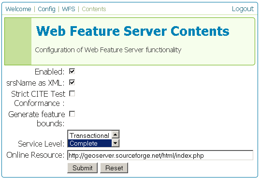
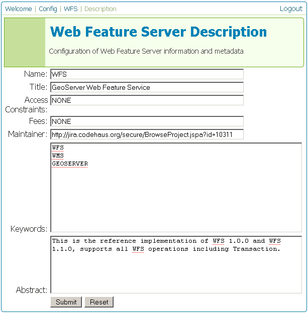
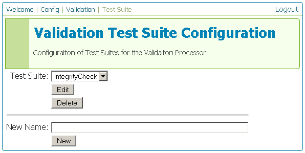

.. _web_admin_config_wfs:

WFS
===

This section is for configuring the Web Feature Service in GeoServer.

.. figure:: wfs.png
   :align: center
   
   *WFS Configuration page*

Contents
--------

The WFS Contents page allows for configuration of the WFS.  The WFS can be enabled or disabled here.  When disabled, WFS requests will not be processed.  There are three other checkboxes:  **srsName as XML** which does WHAT, **Strict CITE Test Conformance**, which does WHAT, and **Generate feature bounds** which does WHAT.  The **Service Level** determines WHAT.  The **Online Resource** box is a URL which contains information relevant to the WFS.

.. note:: Fill in descriptions of the above, obviously.

   
   *WFS Contents page*

Description
-----------

The WFS Description page is the area where information about the WFS is populated.  This information is publicly available via the WFS capabilities document.

   
   *WFS Description page*

.. list-table::
   :widths: 20 80

   * - **Option**
     - **Description**
   * - ``Name``
     -
   * - ``Title``
     -
   * - ``Access Constraints``
     -
   * - ``Fees``
     -
   * - ``Maintainer``
     -
   * - ``Keywords``
     -
   * - ``Abstract``
     -

Validation
----------

.. note:: Description on Validation

   
   *WFS Validation page*

.. note:: More screenshots of Validation needed