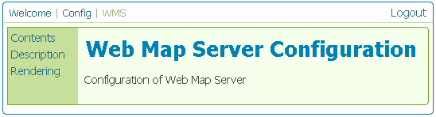
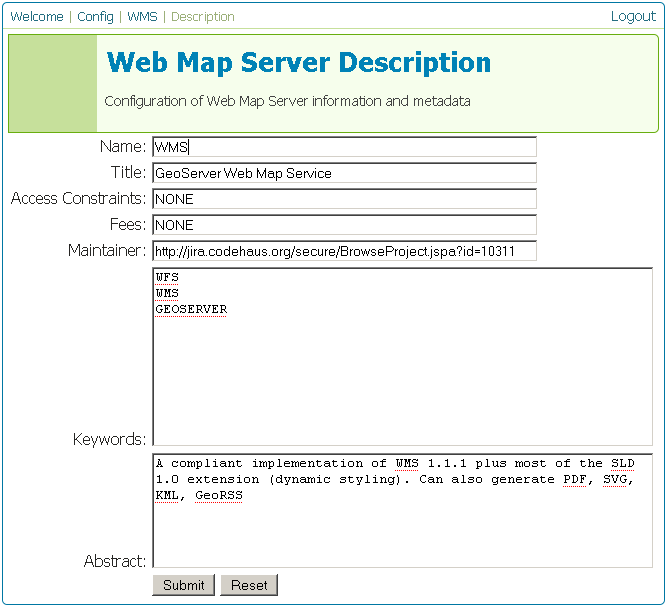

.. _web_admin_config_wms:

WMS
===

This section is for configuring the Web Map Service in GeoServer.

   
   *WMS Configuration page*

Contents
--------

.. figure:: wmscontents.png
   :align: center
   
   *WMS Contents page*

The WMS Contents page allows the WMS to be enabled or disabled.  When disabled, WCS requests will not be processed.  The **Online Resource** box is a URL which contains information relevant to the WCS.

The **Limited Capabilities CRS List** is a box listing of the supported spatial reference systems (SRS).  GeoServer supports a large amount of SRSs, and a list of them is contained in the WMS capabilities document, which can make the document very long.  By default, this box is empty, which means that GeoServer will return all supported SRS.  By populating this box, only those specifically mentioned in the box will be supported (and contained in the WMS capabilities document).

The **Base Maps** section is where layer groups are configured.  Layer groups are collections of WMS layers that can be conveniently referenced as one.

The page displays a list of currently configured layer groups.  The configuration options for each layer group are:

.. list-table::
   :widths: 20 80

   * - **Option**
     - **Description**
   * - ``Layer-group Name``
     - The name of the layer group.
   * - ``Base Map Layers``
     - A list of layers comprising the layer group, separated by commas.
   * - ``Base Map Styles``
     - The style used for the layer group.  If blank, the layers will use their default configured styles.
   * - ``SRS``
     - The projection to use for the layer group.
   * - ``Envelope``
     - The bounding box for the layer group.  Enter coordinates, or click the **GEnerate** button to automatically generate them.

To create a new layer group, click the **Add New Layer-Group** button.

Description
-----------

The WMS Description page is the area where information about the WMS is populated.  This information is publicly available via the WFS capabilities document.

   
   *WMS Description page*
   
.. list-table::
   :widths: 20 80

   * - **Option**
     - **Description**
   * - ``Name``
     -
   * - ``Title``
     -
   * - ``Access Constraints``
     -
   * - ``Fees``
     -
   * - ``Maintainer``
     -
   * - ``Keywords``
     -
   * - ``Abstract``
     -

Rendering
---------

.. figure:: wmsrendering.png
   :align: center
   
   *WMS Rendering page*

The WMS Rendering page has various options for how to generate WMS tiles.  The **SVG Rendering** option does WHAT.  The **Interpolation** does WHAT.

The other options concern **watermarking**.  CONTINUE.

.. note:: Obviously, the info above needs to be fleshed out.
