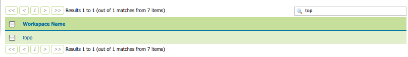

.. _data:

Data
====
Data is perhaps the most important section of the  Web Administration Interface.  Each data section links directly to a data type view page with edit, add and delete access.  While the specifics of these functions vary across data type, a common workflow applies for sorting and searching.  

As seen in the Styles example below, the data view page displays a table of indexed data. 

.. figure:: ../images/data_style.png
   :align: left
   
   *Styles View page*
   
To alphabetically sort a data type, click on the relative link at the top of the table. 

.. figure:: ../images/data_sort.png
   :align: left
   
   *On the left an unsorted Styles view and on the right a Sorted view.*

For simple searching of data type contents, enter the search criteria in the search box and hit Enter.  Geoserver will search the data types that are relevant to your query, and return a search results page.

   
   *Search results for topp workspace.*
   
Specific details for adding, editing and deleting data types are discussed in the following pages.  

.. toctree::
   :maxdepth: 1

   workspaces
   stores
   layers
   layergroups
   styles