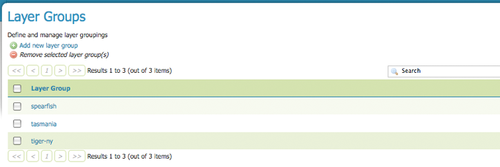
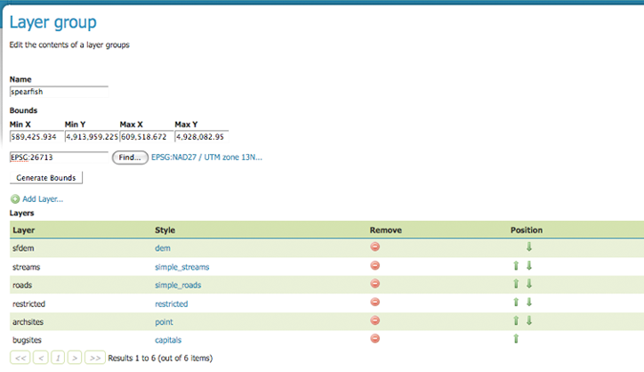
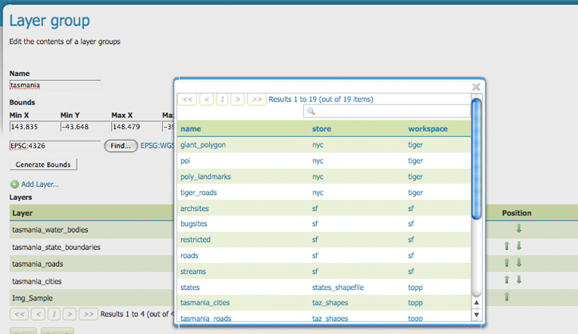
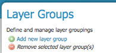
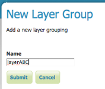
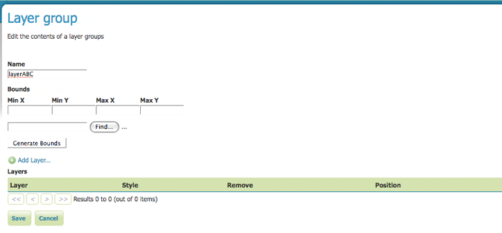

.. _layergroups:

Layer Groups
============
A layer group is a group of layers that can be refered to by one layer name.
For example, if you put three layers--layer_A, layer_B, and layer_C--under the  layer group LayersABC, then when a user makes a WMS getMap request for LayersABC, they will get a map of those three layers.  Layer grouping option is a convenient way to avoid listing many layers when making a WMS request.  The WMS requests will look at the layer group name, and replace it with the layers it represents; then the WMS request is processed.  

The following screenshot shows layer groups view page where the spearfish, tasmania and tiger-ny layers groups are displayed. 

   
   *Layer Groups View*

Edit Layer Group 
----------------
In order to edit layer group, click on a layer group name.  In the example below 
we have the contents and configuration of the spearfish layer group.  The beginning fields allow for the configuration of the layer group's name,  bounds and projection.  To automatically create bounds, select the "Generate Bounds" button, other put in your own custom numbers.  To select an appropriate projection select the "Find" button.

   
   *Layer Groups Edit Page*

Following the configuration fields is a table listing the layers contained within the current layer group.  

Style refers to the style associate with each layer.  To change the style associated with a layer, click the appropriate style link.  As seen below, a list of enabled styles will be displayed. Clicking on a style name, reassigns the layer's style and closes the pop-up. 

.. figure:: ../images/data_layergroups_edit_styles.png
   :align: left
   
   *Edit style for layer within layer group*

To remove a layer from the layer group, select the layer's red minus button.  Note you will not be prompted to confirm or cancel this deletion.  

When a layer group is processed, the layers are rendered in the order provided.  In this example, layer sfdem would be rendered first, streams second, roads third and so on.  The final layer--bugsites--will be rendered on top of the previous layers.  

In order to confirm the order layers are rendered, you can view layers group in the :ref:`layerspreview` section of the web admin.  A zoomed-in OpenLayers preview of the layer group tasmania, with the current order of layers can be seen below.  Notice how the layer tasmania_state_boundaries in green, is below the tasmania_water_bodies in blue, and both are below tasmania_roads in red. 

.. figure:: ../images/data_layergroups_tasmania.png
   :align: left
   
   *Openlayers preview of the layer group tasmania*

A layer can be positioned higher or lower on this list by clicking the green up or down arrows, respectively.  

Further, a layer can be added to the list by pressing the "Add Layer..." button at the top of the layer table. From the resulting list of layers, select the layer to be added by clicking on the layer name. This latest layer will be appended to the bottom of the layer list.  

   *Window for selecting layer to be added to layer group*

Add or Delete a Layer Group
---------------------------
The buttons for adding and deleting a layer group can be found at the top of the Layer Groups view page. 

   *Buttons to add or delete a layer group*
   
To add a new layer group, select the "Add a new layer group" button.  Following, you will be prompted to name the layer group.  Here we have named the layer group, LayersABC.
   

   *Naming a new layer group*
 
After clicking submit, you will be redirected to an empty layer group configuration page.  Begin by adding layers as described in the previous section. Once the layers are positioned accordingly, press "Generate Bounds" for the proposed bounding box and projection.  Press "Save" to add the new layer group. 

   *Empty layer group configuration page*
   
In order to delete a layer group, click on the layer group's corresponding check box.  As with the layer deletion process, multiple layer groups can be checked for removal on a single results page.  Click the "remove selected layer group(s)" link.  As seen below, you will be asked to confirm or cancel the deletion, in this case layerABC.  Selecting "OK" successfully deletes the layer group. 
 
 
.. figure:: ../images/data_layergroups_delete.png
   :align: left
   
   *Confirmation prompt to delete layerABC*
   

       
   

