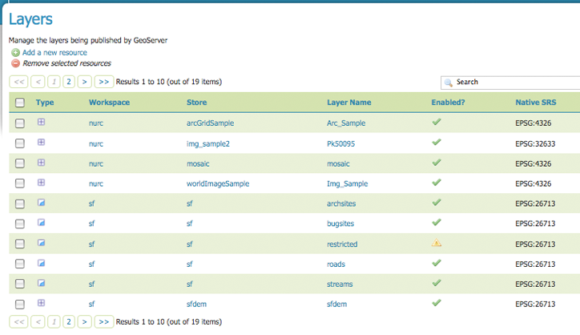
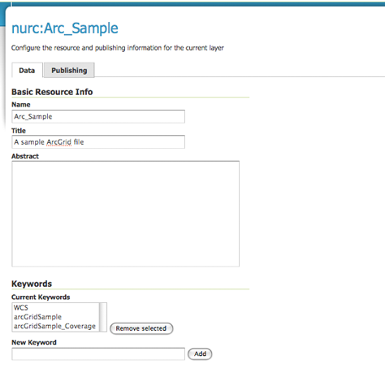
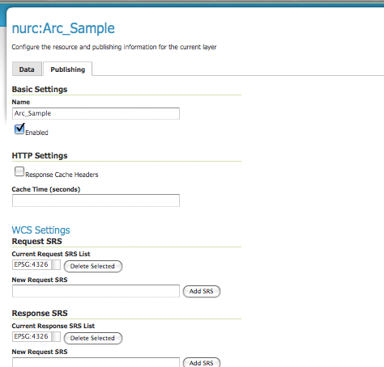
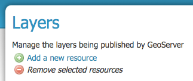
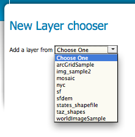
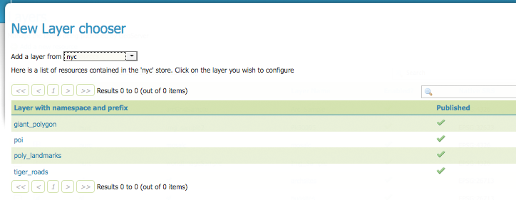
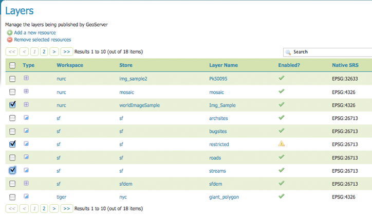
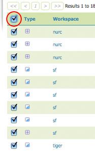

.. _layers:

Layers
======
In Geoserver, the term layer refers to raster or vector data that contains geographic features.  Vector layers are analogous to featureTypes and raster layers are analogous to coverages.  Layers represents each individual feature that needs to be shown on the map. All layers have a source of data, called a Store.

In the layers section, you can view and edit an existing layers, add (register) a new layer, or delete (unregister) a layer.  As previous View tables, the Layers View displays relevant dependencies, i.e., the layer with the store within the workspace.  The View page also displays the layer's status and native SRS (a.k.a. projection).


   
   *Layers View*
   
Layer Types
-----------
Layers are organized into two types of data, raster and vector.  As described in the `Salmonid Habitat Restoration Planning Resource <http://www.cfses.org/salmonid/html/spatial/spatial.htm>`_ the difference between the two formats rests in how they each store spatial information.  Vector types store information about feature types as mathematical paths--a point as a single x,y coordinate, lines as a series of x,y coordinates, and polygons as a series of x,y coordinates that start and end on the same place. Raster format data is a cell-based representation of earth surface features. Each cell has a distinct value, and all cells with the same value represent a specific feature. Image and grid file types are stored in raster format 

.. list-table::
   :widths: 5 70 

   * - **Field**
     - **Description**

   * - .. figure:: ../images/data_layers_type1.png
     - raster (grid)
   * - .. figure:: ../images/data_layers_type2.png
     - vector (feature)  
     
.. _edit_layer_data:

Edit Layer Data 
---------------
Clicking the layer name opens a layer configuration panel.  The Data tab, activated by default, allows you to define and change data parameters for a layer.  


   
   *Layers Data View*   
   
Basic Info
```````````
The beginning sections--Basic Resource Info, Keywords and Metadata link are analogous to the :ref:`service_metadata` section for WCS, WFS and WMS. These sections provide "data about the data," specifically textual information that make the layer data easier to work with it. 

**Name:**
Identifier used to reference the layer in WMS requests. 

**Title:**
 A human-readable description to briefly identify the layer to clients. (Required)   
   
**Abstract:**
Provides a descriptive narrative with more information about the layer. 
   
**Keywords:**
List of short words associated with the service to aid in catalog searching.
 
**Metadata Link:**
Allows linking to external documents that describe the data layer. he standard to which the metadata complies. Currently only two standard format types are valid: TC211 and FGDC.  TC211 refers to the metadata structure established by the `ISO Technical Committee for Geographic Information/Geomatics <http://www.isotc211.org/>`_ (ISO/TC 211) while FGDC refers to those set out by the `Federal Geographic Data Committee <http://www.fgdc.gov/>`_ (FGDC) of the United States. 

.. figure:: ../images/data_layers_meta.png
   :align: left
   
   *Adding a metadata link n FGDC format*  
   
Coordinate Reference Systems
````````````````````````````
A coordinate reference system (CRS) defines how your georeferenced spatial data relates to real locations on the Earth’s surface.  CRSs are part of a more general model called Spatial Reference Systems (SRS), which includes referencing by coordinates and geographic identifiers.   To view all supported spatial reference systems visit the SRS in the Demos section.  

The most commonly used SRS's can be specified via their EPSG (European Petroleum Survey Group) code. 

.. figure:: ../images/data_layers_CRS.png
   :align: left
   
   *Adding a metadata link n FGDC format*  

Geoserver needs to know what Coordinate Reference System (CRS) are your data expressed in. This information is used to compute the lat/lon data bounding box and re-project your data during both WMS and WFS requests

**Native SRS:**
Refers to the projection the layer is stored in. Clicking on the projection link displays a description of the SRS.

**Declared SRS:**
Refers to what GeoServer gives to clients. 

**SRS Handling:**
 Determines how GeoServer should handle projection when the two SRS differ.  

Bounding Boxes
``````````````
The bounding box is automatically determined by taking the union of the bounds of the specified layers. In essence, it determines the extent of the map. By default, if you do not specify bbox, it will show you everything. If you have one layer of Los Angeles, and another of New York, it show you most of the United States. The bounding box, automatically set or specified, also determines the aspect ratio of the map. If you only specify one of width or height, the other will be determined based on the aspect ratio of the bounding box.  

.. list-table::
   :widths: 30 70 

   * - **Field**
     - **Description**

   * - Native Bounding Box
     - 
   * - Compute
     -      
   * - Bounding Box
     -      
   * - Compute
     -  
     
 

Coverage Parameters (Raster)
````````````````````````````

Coverage parameters change depending on the type of data source. 

.. list-table::
   :widths: 30 70 

   * - **Field**
     - **Description**

   * - ReadGridGeometry2D
     - WorldImage
   * - InputImageThresholdValue
     - ImageMosaic     
   * - InputTransparentColor
     - ImageMosaic 
   * - OutputTransparentColor
     - ImageMosaic 
     
Feature Type Details (Vector)
`````````````````````````````
Instead of coverage parameters, vector layers have a listing of properties.

.. list-table::
   :widths: 30 70 

   * - **Field**
     - **Description**

   * - Property
     - Items within 
   * - Type
     - .       
   * - Nillable
     - whether it is required to have a value or can be left blank.  right now all fields are Nillable. This might change when complex featuretypes are added.
   * - Min/Max Occurrences
     - that's how many values that field is allowed ot have.  and right now because geoserver supports 1/0 but might be extended with the complex feature work.      
     

Edit Publishing Information 
---------------------------
The publishing tab allows for configuration of HTTP and WCS settings.



   
   *Layers Data View*   

Basic Settings
``````````````

.. list-table::
   :widths: 30 70 

   * - **Field**
     - **Description**

   * - Name
     - 
   * - Enabled
     - disable a layer. 

HTTP Settings
`````````````
paramters that are applied tothe http respinse when a client requests dat fro this layter. right now its only cache stuff.  

.. list-table::
   :widths: 30 70 

   * - **Field**
     - **Description**

   * - Response Cache Headers
     - if checked, geoserver will request broweser viewing tiles form this server, will not request the same tile twice within the same time specified in cache time.  whch defaults to one hour (measured in seconds) 
   * - Cache Time
     - 

WMS Attribution
```````````````

The WMS Attribution section of the layer configuration page allows you to publish information about data providers.  The information is broken up into several fields:

.. list-table::
   :widths: 30 70

   * - **Field**
     - **Description**
   * - Attribution Text
     - Human-readable text describing the data provider.  This might be used as the text for a hyperlink to the data provider's web site.
   * - Attribution Link
     - A URL to the data provider's website.
   * - Logo URL
     - A URL to an image that serves as a logo for the data provider.
   * - Logo Content Type, Width, and Height
     - These fields provide information about the logo image that clients may use to assist with layout.  GeoServer will auto-detect these values if you click the :guilabel:`Auto-detect image size and type` link at the bottom of the section.

The text, link, and logo are each advertised in the WMS Capabilities document if they are provided; some WMS clients will display this information to allow users to know which providers provide a particular dataset.  If you omit some of the fields, those that are provided will be published and those that are not will be omitted from the Capabilities document.

WFS Settings
````````````
vector: they control how geoserver of data when its being accesed via wfs.  per-request feature limit: that's the max number of geatures to return in wfs response.  if its 0 tht means there's no limit.  there's also the global setting which generally makes more sense if you're trying to limitt he bandwidth you're using on theserver. 

WCS Settings
````````````

.. list-table::
   :widths: 30 70 

   * - **Field**
     - **Description**

   * - Current Request SRS List
     - those are the SRS's to advertsite that this layer can be converted to. 
   * - New Request SRS
     - add and srs to that link. 

Interpolation Methods
`````````````````````

.. list-table::
   :widths: 30 70 

   * - **Field**
     - **Description**

   * - Default Interpolation Method
     - that's basic how geoserver should dcale image as you zoom in. the options are nearest neighbor, bilinera and bicubuc.  WCS server wide setting. layer settings override global settings.  
   * - Current Interpolation Method
     -

Formats
```````

.. list-table::
   :widths: 30 70 

   * - **Field**
     - **Description**

   * - Native Format
     - which formatshold be advertsiing as supported by this layer.  there's really not that much reason to limit this.  double check with garbiel about. 
   * - Supported Formats
     - 

Default Title
`````````````
where you assign the style.  WMS settings. addiotnal stylesare ones to be advertised with this later in the capabilities document. 

.. list-table::
   :widths: 30 70 

   * - **Field**
     - **Description**

   * - Default Style
     -
   * - Additional Styles
     - 
   * - Default WMS Path
     - thats a prefix to the wms service. basically lets you expose different kind of groupings of layers.  so if the wms path is set, instead of geoserver/wms it will be whatever path is set. (that will probably go away)
     
Geosearch
`````````
whether to allow the Google Geo search crawler, to index from this particular layer.  
.. seealso:: http://www.google.com/support/webmasters/bin/answer.py?hl=en&answer=94554

.. list-table::
   :widths: 30 70 

   * - **Field**
     - **Description**

   * - Enable
     -  
   	 
KML Format Settings (Vector)
````````````````````````````

.. list-table::
   :widths: 40 60 

   * - **Field**
     - **Description**

   * - Default Regionating Attribute
     - regionating isthe proces of breaking up the data set so that geoserver can get back the largest or most iprtant features of a layer first and the win is that if you ahve milliosn of lines in it, then geoserve can only send the first 100 was you start with. and as you zoom if will fill out more detail. regionating param is the value the geoserver will look at from the data.  to decie whcih feature will show up first.  higher values of thatr attribute will be used first. proprtiest from data feature types. 
   * - Default Regionating Method
     - external-sorting means that geoserver will do the sorting itself, outsie od the data store. that's gaurenteed to work for any data set. but it will be slower then native storing.  post gis you should use native sorting, and for everything else use external. , geometry: sort by the size of the geom, if its polygon it uses the area, if its a line it usues the length. , native-sorting, random: just takes the data and generates some random value.  thats what you should use if you don't have any particular value.  to avoid clustering, because certain geptail data will use index will . too much detail.  
   * - Features Per Regionated Tile
     - controls number of features to be includd. the more complex your geomerties the lower that value should be.  10 is a pretty consertive value.  safe to go up to 100 for point data.  higher values for that, mean more data show up sooner so don't have to zoom in.   

Add or Delete a Layer
---------------------     
I just added a postgis table and i can choose which data i want to expose.  show data that's already there. its not new as int he sanese that it's not already there.  its new in the sense of that its not exposed. 


At the upper left-hand corner of the layers view page there are two buttons for the adding and deletion of layers.  The green plus button allows you to add a new layer, here referred to as resource.  The red minus button allows you to remove selected layers.  



   
   *Buttons to Add or Remove a Layer*  

Clicking on the "Add a new resource" button brings up a "New Layer Chooser" panel.  The drop down menu displays all currently enabled stores.  From this menu, select the Store where the layer should be added.  


   
   *List of all currently enabled stores* 

Upon selection of a Store, a view table of existing layers within the selected store will be displayed.  In this example, giant_polygon, poi, poly_landmarks and tiger_roads are all layers within the NYC store. 


   
   *View of all layers* 

Upon selection of a layer name, you're redirected to a layer edit page. :ref:`edit_layer_data` 
     
In order to delete a layer, click on the check box on the left side of each layer row.  As shown below, multiple layers can be checked for removal on a single results page.  It should be noted, however, that selections for removal will not persist from one results pages to the next.  
  

   
   *Layers nurc:Img_Sample, sf:restricted, sf:streams selected for deletion*
   
All layers can be selected for removal by enabling the checkbox in the header row. 


   
   *All layers selected to be deleted*
   
   
Once layer(s) are checked, the "Remove selected resources" link is activated.  Upon clicking on the link, you will be asked to confirm or cancel the deletion.  Selecting "OK" successfully deletes the layer. 
     
     
     
     
     
     
