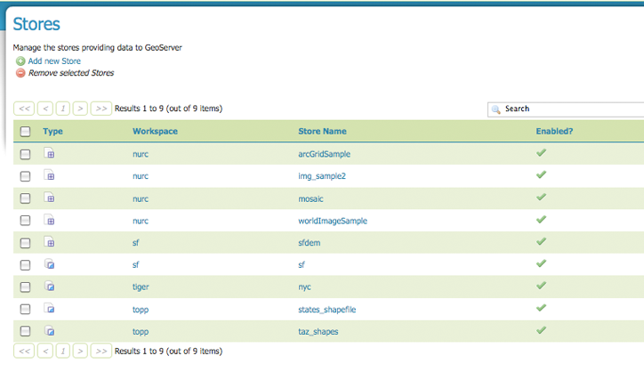
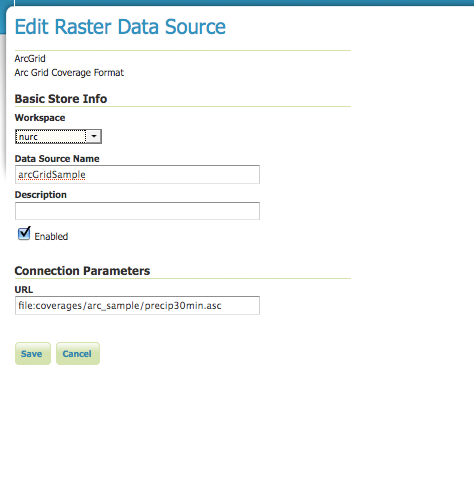
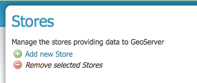
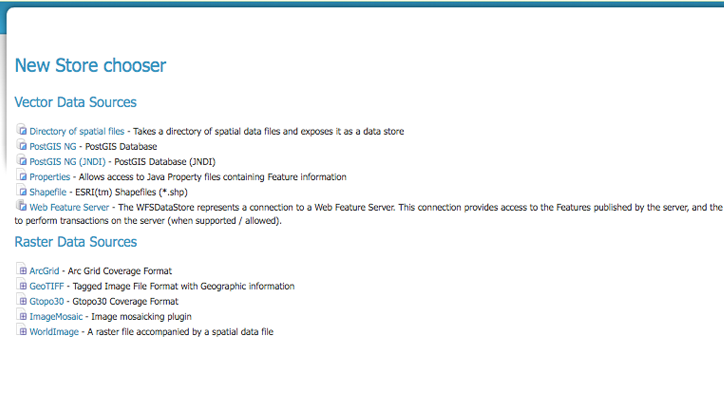
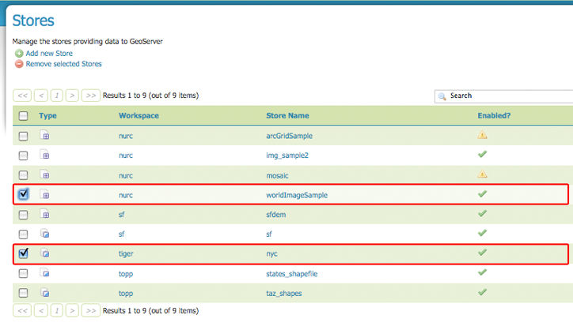

.. _stores:

Stores
======
A store connects to a data source that contain raster or vector data. A data source can be a file or group of files such as a table (e.g., database), a single file (e.g., shapefile), or a directory (e.g., Vector Product Format (VPF) library).  The store construct is used so that connection parameters are defined once, rather than for each piece of data in a source.  As such, it is necessary to register a store before loading any data.  

The following screenshot shows stores view page. Here 9 stores are displayed, organized by type.  


   
   *Stores View*


While there are many potential formats for data source, there are only four types of stores.  For raster data, a store can be a file; for vector data, a store a file, database or server.  Three of four store types are shown in the screenshot above--raster data in a file, vector data in a file, and vector data in a database.  

Type Icons
``````````

.. list-table::
   :widths: 5 70 

   * - **Field**
     - **Description**

   * - .. figure:: ../images/data_stores_type1.png
     - raster data in a file
   * - .. figure:: ../images/data_stores_type3.png
     - vector data in a file
   * - .. figure:: ../images/data_stores_type2.png
     - vector data in a database 
   * - .. figure:: ../images/data_stores_type5.png
     - vector server (web feature server)
     
     

Editing a Store
---------------
In order to view and correspondingly edit a store, click on a store name.  The exact contents of this page will depend on the specific format chosen, so please see the section on :ref:`working` for information on specific data formats. In the example below we have the contents of the nurc ArcGridSample store.  



   
   *Editing Form for Raster Data Stores*

While connection parameters will vary depending on data format, some the basic information in common across formats.  The Workspace drop-down menu lists all registered workspaces.  The store (e.g., arcGridSample) is assigned to the selected workspace (e.g., nurc).  Data Source name is the Store name, as listed on the view page.  The Description is optional and only displays in the administration interface. Enabled allows you to 'turn off' access to the store, and all data defined in it. 

Adding or Delete a Store
------------------------
The buttons for adding and deleting a workspace can be found at the top of the Workspaces view page. 


   
   *Buttons to add and delete store*

To add a workspace, select the "Add new Store" button.  You will be prompted to choose a kind of data source.  Currently Geoserver natively supports ten formats.  For vector data, these sources include a directory of spatial files, two PostGIS databases, java properties files, ESRI shapefiles and a Web Feature Server.  For raster data, these sources include file formats ArcGrid, GeoTiff, Gtopo30, ImageMosaic and WorldImage.  


   
   *Choosing the data source for a new store*

The next page will configure the store. An example on an ArcGrid configuration page can be seen below.  However, since connection parameters differ across data source, the exact contents of this page depend on the store's specific format. Please see the section on :ref:`working` for information on specific data formats. Or for a quick introduction to adding a shapefile data source, review the tutorial on :ref: `shapefile_quickstart`.

.. figure:: ../images/data_stores_add.png
   :align: left
   
   *Configuration page for adding an ArcGrid data source*
   
In order to delete a store, click on the store's corresponding check box.  As with previous deletion processes, multiple stores can be checked for removal on a single results page.  


   
   *worldImageSample and nyc stores checked for deletion*

Click the "Remove selected Stores" button.  As seen below, you will be asked to confirm the deletion of the the data within each store.  Here Img_Sample contained within the worldImageSample store will be deleted along with  poly_landmarks, poi, tiger_roads, giant_polygon from the nyc store. Selecting "OK" successfully deletes the store, and redirects to the revised Stores View page.


   
   *Confirm Deletion of worldImageSample and nyc stores*


