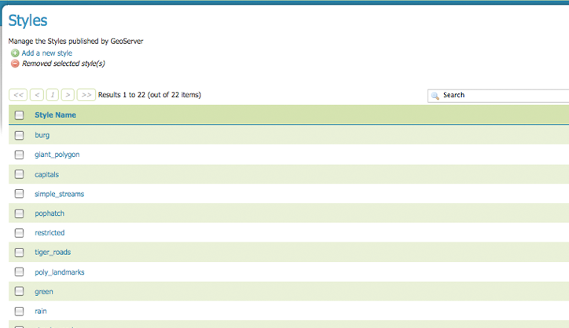
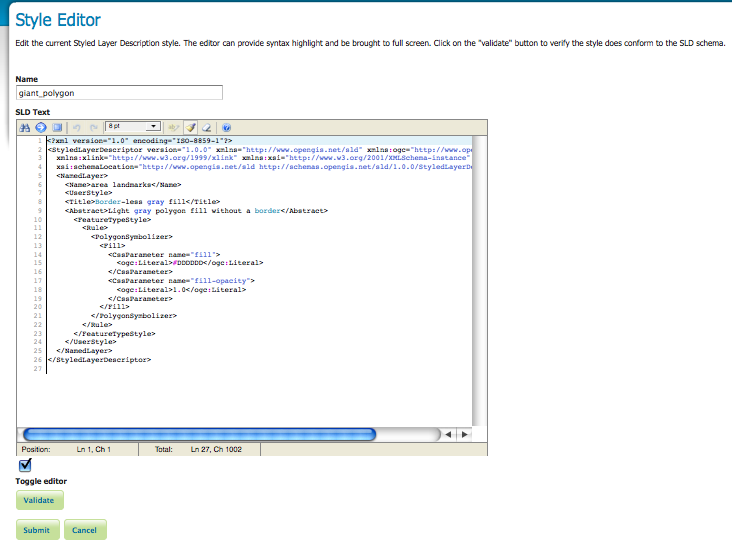
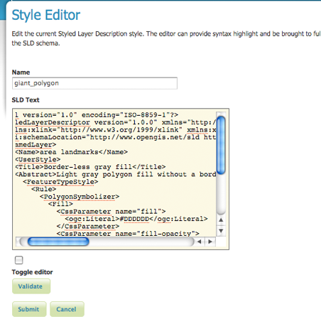
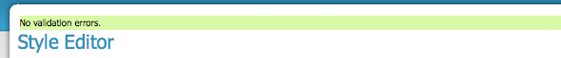
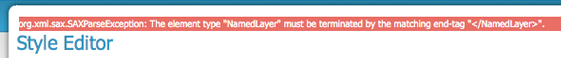
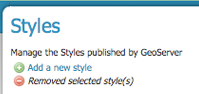
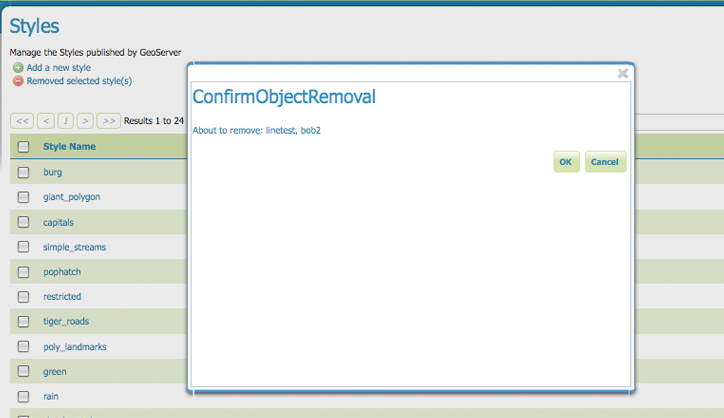

.. _styles:

Styles
======
Styles are methods of rendering geospatial data. Styles for GeoServer are written in Styled Layer Descriptor (SLD), a subset of XML. Please see the section on :ref:`styling` for more information on working with styles.  

On this page, you can register or create a new style, edit (configure) an existing style, or delete (unregister) a style.


   
   *Styles View*

Edit Styles
------------
The Style Editor page presents options for configuring a style's name and code.  SLD names are specified at the top in the name field.  Typing or pasting of SLD code can be done in one of two modes. The first mode is an embedded `editarea <http://www.cdolivet.com/index.php?page=editArea&sess=2c779c1037faabdcd95326e6777b79c1>`_ for editing SLDs in a textarea.


   
   *Embedded style editarea*
   
This editor is design for text formatting, search and replace, line numbering,  and real-time syntax highlighting.  You can also switch view to full-screen mode for a larger editing area. 


Editarea Funcions
`````````````````
Edit area actions are listed below. 

.. list-table::
   :widths: 5 70 

   * - **Field**
     - **Description**

   * - .. figure:: ../images/data_style_editor1.png
     - search
   * - .. figure:: ../images/data_style_editor2.png
     - go to line   
   * - .. figure:: ../images/data_style_editor3.png
     - fullscreen mode
   * - .. figure:: ../images/data_style_editor4.png
     - undo     
   * - .. figure:: ../images/data_style_editor5.png
     - redo
   * - .. figure:: ../images/data_style_editor6.png
     - toggle syntax highlight on/off
   * - .. figure:: ../images/data_style_editor7.png
     - reset highlight (if desynchronized from text)
   * - .. figure:: ../images/data_style_editor8.png
     - about
     

The second editing mode is an unformatted text area.  The checkbox at the bottom of the page, labeled "Toggle editor" allows you to switch from the default editarea to the undformatted textarea.


   
   *Textarea for SLD editing*
   
To confirm that the SLD code is fully compliant with the SLD schema, press the "Validate" button.  Once clicked, a message box confirms either "no validation errors" or the first error encountered while processing. 


   
   *No validation errors* 
   

   
   *Validation error message* 

Add or Delete a Style
---------------------
The buttons for adding and deleting a style can be found at the top of the Styles view page. 



   *Buttons to add or delete a style*
   
To add a new layer group, select the "Add a new style" button.  You will be redirected to an Style Editor with a blank name field and a basic point SLD with a 6px red square. A name is required for a new style.  

This editor page provides two options for submitting an SLD. There is the option of typing/pasting the SLD code by the embedded editarea or textarea modes, as earlier described.  Or you can select and upload a local file that contains the SLD.

.. figure:: ../images/data_style_upload.png
   :align: left

   *For a new style, you can upload an sld file from your local computer.*
   
Once a style is successfully sbumitted, you will be redirected to the styles view page where the latest style has been appended. 

In order to delete a style, click on the style's corresponding check box.  As with the layer deletion process, multiple layer groups can be checked for removal on a single results page.  Click the "remove selected style(s)" link at the top of the page.  As seen below, you will be asked to confirm or cancel the deletion, in this case both linetest and bob2.  Selecting "OK" successfully deletes the layer group. 
 
 

   
   *Confirmation prompt to delete styles linetest and bob2*
   

   


