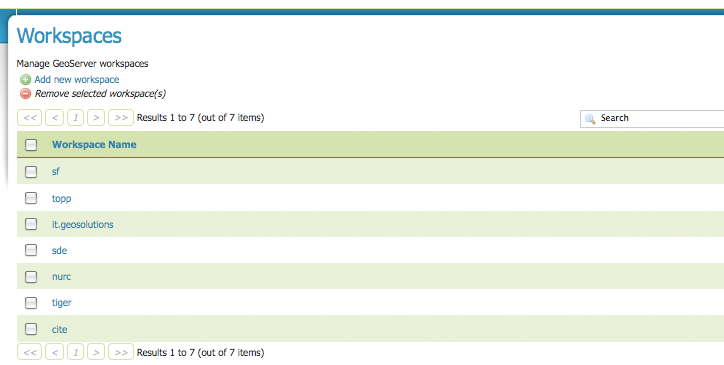
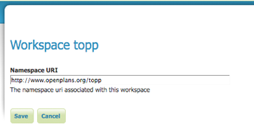
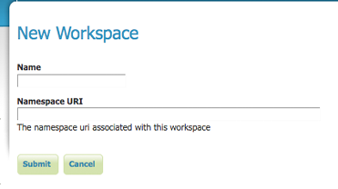
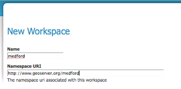
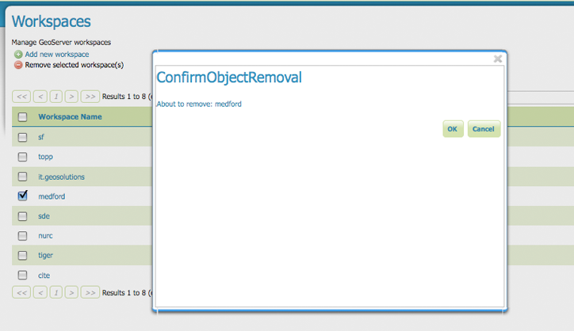

.. _workspaces:

Workspaces
==========
This section is for viewing and configuring your workspaces.  Analogous to a namespace, a workspace is a container which is used to organize other items.    In GeoServer, a workspace is often used to group similar layers together. Individual layers are often referred to by their workspace name, colon, then store. (Ex: topp:states) Two different layers having the same name can exist as long as they exist in different workspaces. (Ex: sf:states, topp:states)  The following screenshot shows the Workspaces view page where the sf, topp, it.geosolutions, sde, nurc, tiger and cite are displayed.

   
   *Workspaces View page*

Edit Workspace
--------------
In order to view and correspondingly edit a workspace, click on a workspace name.  In the example below we have the contents of the topp workspace.  

   
   *Topp workspace URI*
   
Notice that the topp workspace consists of a name and a Namespace URI (Uniform Resource Identifier).  URI's are like URLs (the L is for Locator), except URIs need not point to a location on the web. They only need to be a unique identifier.  For a Workspace URI, we recommend using a URL associated with your project, with perhaps a different trailing identifier, such ``http://www.openplans.org/topp`` for the topp workspace.  
   
Add or Delete a Workspace
---------------------------
The buttons for adding and deleting a workspace can be found at the top of the Workspaces view page. 

.. figure:: ../images/data_workspaces_add_delete.png
   :align: left
   
   *Buttons to add and delete*
   
To add a workspace, select the "Add new workspace" button.  Following, you will be prompted to enter the the workspace name and URI.   
   

   
   *Add Workspace Form*   
   
Here we have named the workspace, medford and located the URI at ``http://www.geoserver.org/medford``.  Press "Submit" to add the new workspace. 

   
   *Entered Medford workspace*
  
In order to delete a workspace, click on the workspace's corresponding check box.  As with the layer deletion process, multiple workspaces can be checked for removal on a single results page.  Click the "remove selected workspaces(s)" button.  As seen below, you will be asked to confirm or cancel the deletion, in this case medford.  Selecting "OK" successfully deletes the workspace. 

   
   *Confirm Deletion*
      