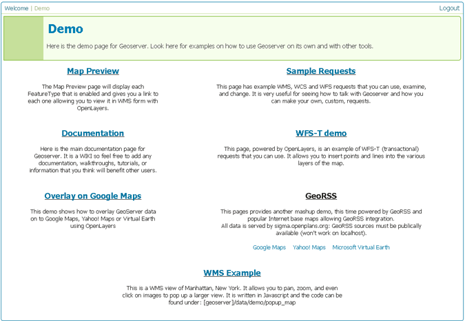
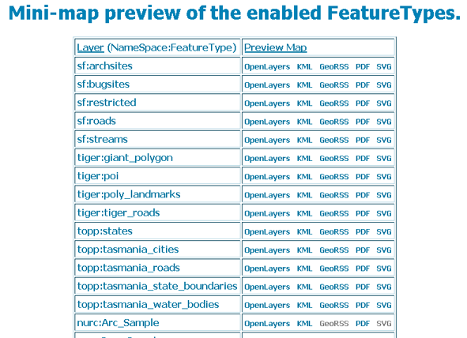
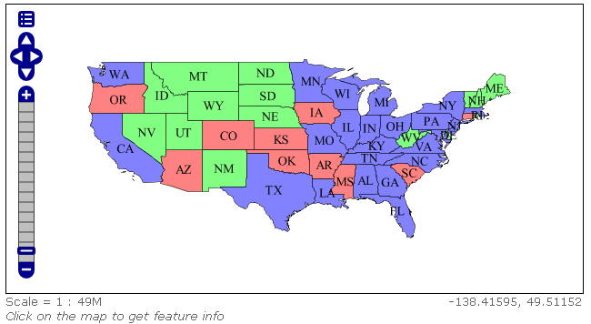

.. _web_admin_demo:

Demo menu
=========

The Demo menu contains helpful links to various demos and information pages regarding GeoServer and its various features. 


   
   *Demo menu*


.. _web_admin_map_preview:   

Map Preview
-----------

The Map Preview page is a listing of all registered featuretypes and layer groups configured in GeoServer.  The page has quick links to output these layers in various formats.

.. note:: These are not all fo the output formats available through GeoServer.  Please see the section on :ref:`services` for more information on output formats.


   
   *Map Preview page*

The output formats accessible from this page are:

.. list-table::
   :widths: 20 80

   * - **Option**
     - **Description**
   * - ``OpenLayers``
     - Generates a simple OpenLayers application.
   * - ``KML``
     - Uses the KML reflector to output KML (Keyhole Markup Language).
   * - ``GeoRSS``
     - Outputs GeoRSS, a geographic form of an RSS feed.
   * - ``PDF``
     - Takes a snapshot of the default WMS output and creates a document in PDF (Portable Document Format).
   * - ``SVG``
     - Takes a snapshot of the default WMS output and creates a document in SVG (Scalable Vector Graphics) format.

OpenLayers output
`````````````````	 
	 
The OpenLayers output has some advanced filters that are not available when using a standalone version of OpenLayers.  The application that is generated contains a header which has options for easy configuration of display.


   
   *OpenLayers demo*

To toggle this menu, click on the icon at the top left of the OpenLayers window.

.. figure:: customol.png
   :align: center
   
   *Customizing the OpenLayers demo application*

The possible configuration options are:

.. list-table::
   :widths: 20 80

   * - **Option**
     - **Description**
   * - ``Tiling``
     - Sets whether the window is populated with a single tile (redrawn with every refresh), or as a grid of tiles (refreshed only as necessary).
   * - ``Antialias``
     - Sets the antialias of the tiles.  Options are ``Full``, ``Text Only``, and ``Disabled``.
   * - ``Format``
     - Sets the image format of the tiles.  Options are ``PNG 24bit``, ``PNG 8bit``, ``GIF``, and ``JPEG``.
   * - ``Width/Height``
     - These values set the width and height of the OpenLayers application window.  If set to ``Auto``, the application will determine tha optimal size.
   * - ``Fliter``
     - Allows custom queries to run on the dataset.  Options are ``CQL``, ``OGC``, and ``FeatureID``.  The specific query should be entered in the box next to this field.
  
Documentation
-------------

This is a link to the online GeoServer documentation.

.. warning:: These demos may change, so this section is unpopulated for now.

Overlay on Google Maps
----------------------

Sample Requests
---------------

WFS-T demo
----------

GeoRSS
------

WMS Example
-----------

