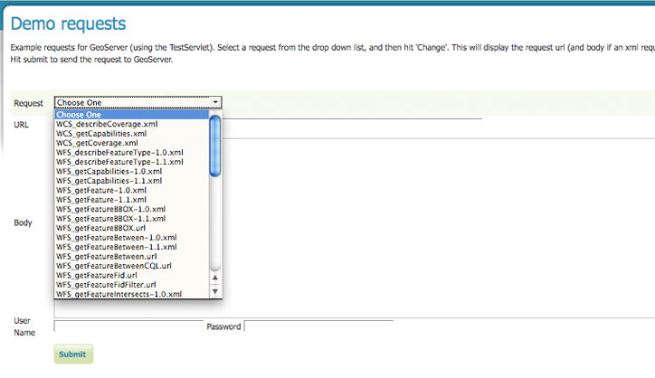
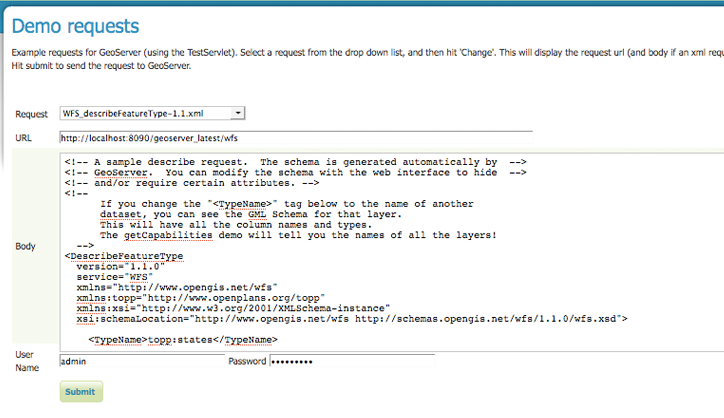
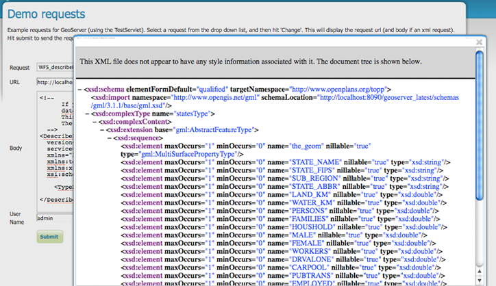
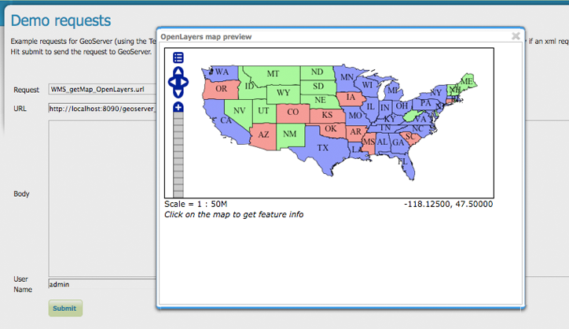
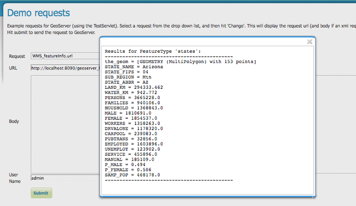
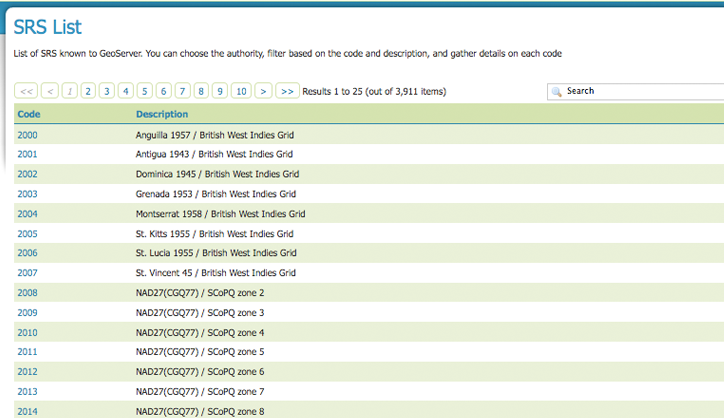
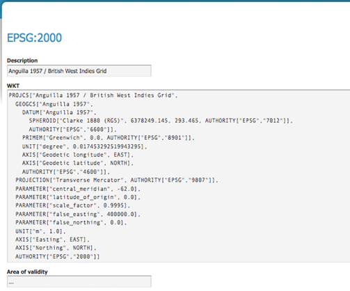

.. _demos:

Demos
=====
The Demos page contains helpful links to various information pages regarding GeoServer and its features.  You do not need to be logged into GeoServer to access Demo information.

.. figure:: ../images/demos_view.png
   :align: left
   
   *Demos View*

Demo Requests
-------------
This page has example WMS, WCS and WFS requests for Geoserver that you can use, examine and change.    Example requests for GeoServer. Select a request from the drop down list.  

   
   *Drop-down menu for selecting demo requests*

Both Web Feature Services (:ref:`wfs`) as well as Web Coverage Service (:ref:`wcs`) requests will display the request url and the XML body. Web Map Service (:ref:`wms`) requests will display the request URL.  Here we have a sample WFS DescribeFeatureType request. Notice that the request name, URL, body and authentication username/password are   
specified. 

   
   *WFS_describeFeatureType-1.1xml request*

Hit submit to send the request to GeoServer.   For WFS and WCS requests, GeoServer will automatically generate a schema.   

   
   *Generated XML schema from WFS_describeFeatureType-1.1xml request*
   
For WMS DescribeLayer requests, hitting submit downloads an XML description of the specified map layer.  Similarly, submitting a WMS GetCapabilities request downloads a list of the server's data, as well as valid WMS operations and parameters.  As seen in the Openlayers example below, GetMap requests display an image based on the provided geographic data.  

   
   *OpenLayers WMS GetMap request*
   
WMS GetFeatureInfo requests retrieve information regarding a particular feature on the map image. The following example displays the results for the FeatureType 'states.'  

   
   *WMS GetFeatureInfo request for FeatureType 'states'*

.. _srs_list:

SRS
---
GeoServer natively supports 3,911 Spatial Referencing Systems (SRS). A spatial reference system defines an ellipsoid, a datum using that ellipsoid, and either a geocentric, geographic or projection coordinate system.  Morten Nielsen gives and excellent explanation of SRS in `SharpGIS <http://www.sharpgis.net/post/2007/05/Spatial-references2c-coordinate-systems2c-projections2c-datums2c-ellipsoids-e28093-confusing.aspx>`_ .  With the Geoserver SRS List, you can view, filter and authorize each SRS code.

   
   *Listing of all Spatiali Refering Systems (SRS) known to Geoserver*
   
On the SRS List, Code refers to the unique integer identifier defined by the author of that spatial reference system.  Each Code is linked to a more detailed description page. 

   
   *Details for SRS EPSG:2000*

The title of each SRS is composed of the Author Name and the unique integer identifier (e.g., Code) defined by the Author.  In this example, the author is the `European Petroleum Survey Group <http://www.epsg.org/>`_ (EPSG) and the Code is 2000.  

Well-known text (WKT) is a text markup language for representing vector geometry objects on a map, spatial reference systems of spatial objects and transformations between spatial reference systems.  Here the WKT field is a string describing the SRS.

Area of validity refers to geographic bounding box for the SRS. 

